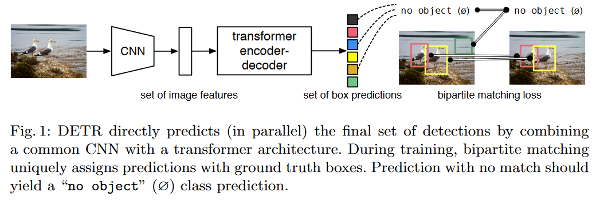

# Abstract

我们提出了一种将目标检测视为直接集合预测问题的新方法。我们的方法简化了检测流程，有效地消除了许多手工设计的组件的需求，例如非极大值抑制过程或显式地编码我们关于任务的先验知识的锚点生成。这个新框架的主要组成部分被称为DEtection TRansformer或DETR，它包括一个基于集合的全局损失，通过二分图匹配强制产生唯一的预测，以及一个Transformer编码器-解码器架构。在给定一组固定的学习目标查询的情况下，DETR通过推理对象之间的关系和全局图像上下文，直接并行输出最终的预测集合。这个新模型在概念上很简单，不需要专门的库，不同于许多其他现代探测器。DETR在具有挑战性的COCO目标检测数据集上展示了与成熟且高度优化的Faster RCNN基准模型相当的准确性和运行时性能。此外，DETR可以轻松地推广到以统一的方式生成全景分割。我们展示了它明显优于竞争基线的性能。训练代码和预训练模型可在https\://github.com/facebookresearch/detr获取。

# 1 Introduction

目标检测的目标是为感兴趣的每个对象预测一组边界框和类别标签。现代探测器以间接的方式解决了这个集合预测任务，通过在大量的提议\[37,5]、锚点\[23]或窗口中心\[53,46]上定义替代的回归和分类问题。它们的性能受到后处理步骤的影响，用于合并接近重复的预测，锚点集合的设计以及将目标框分配给锚点的启发式算法\[52]。为了简化这些流程，我们提出了一种直接的集合预测方法，绕过了替代任务。这种端到端的思想已经在复杂结构化预测任务中取得了重大进展，比如机器翻译或语音识别，但在目标检测领域尚未得到应用：以前的尝试\[43,16,4,39]要么添加了其他形式的先验知识，要么在具有挑战性的基准测试中没有与强基准模型竞争。本文旨在弥补这一差距。

我们通过将目标检测视为直接集合预测问题来简化训练流程。我们采用了一种基于transformers \[47]的编码器-解码器架构，这是一种用于序列预测的流行架构。transformers的自注意机制可以明确地对序列中的各个元素之间的所有成对交互进行建模，使得这些架构特别适用于集合预测的特定约束，例如去除重复预测。

我们的DEtection TRansformer（DETR，请参见图1）一次性预测所有目标，并通过一种集合损失函数进行端对端训练，该函数在预测和实际目标之间进行二分匹配。DETR通过丢弃多个基于先验知识的手动设计组件（如空间锚点或非极大值抑制），简化了检测流程。与大多数现有的检测方法不同，DETR不需要任何定制的层，因此可以在包含标准卷积神经网络和变换器类的任何框架中轻松复现。

相对于大多数之前关于直接集合预测的工作，DETR的主要特点是将二分匹配损失和具有非自回归并行解码的变压器相结合\[29,12,10,8]。相比之下，之前的工作专注于使用RNN进行自回归解码\[43,41,30,36,42]。我们的匹配损失函数将预测结果唯一地分配给一个真实对象，并且对于预测对象的排列是不变的，因此我们可以并行地发射它们。

我们在最流行的目标检测数据集COCO \[24]上评估了DETR，并将其与非常有竞争力的Faster R-CNN基线\[37]进行了对比。Faster RCNN经历了许多设计迭代，并且与最初的论文相比性能有了很大的提升。我们的实验表明，我们的新模型的性能相当可观。更具体地说，DETR在大型物体上表现出显著优异的性能，这可能是transformer的非局部计算所带来的结果。然而，它在小型物体上的性能较差。我们期待未来的工作将改善这个方面，就像FPN \[22]对于Faster R-CNN的发展一样。

DETR对象检测器的训练设置与标准对象检测器的训练设置在多个方面有所不同。新的模型需要更长的训练计划，并且可以从Transformer中的辅助解码损失中受益。我们深入探讨了哪些组件对所展示的性能至关重要。

DETR的设计理念很容易扩展到更复杂的任务上。在我们的实验中，我们展示了在预训练的DETR之上训练的简单分割头部在泛型分割\[19]（一项近期变得流行的具有挑战性的像素级别识别任务）上优于竞争基线的表现。

# 2 Related work

我们的工作基于多个领域的先前工作，包括用于集合预测的二分匹配损失、基于Transformer的编码器-解码器架构、并行解码和目标检测方法。

## 2.1 Set Prediction

目前没有一种经典的深度学习模型可以直接预测集合。基本的集合预测任务是多标签分类（例如，在计算机视觉领域的参考文献中，可以参考\[40,33]），对于其中存在元素之间的潜在结构（即，接近相同的边界框）的检测问题，基线方法（例如，一对其余）并不适用于解决。在这些任务中的首要困难是避免接近重复。大多数当前的检测器使用非最大值抑制等后处理方法来解决这个问题，但直接的集合预测则无需后处理。它们需要使用全局推理方案来建模所有预测元素之间的相互作用，以避免冗余。对于常规大小的集合预测，稠密全连接网络\[9]已经足够，但代价较高。一种通用的方法是使用自回归序列模型，例如循环神经网络\[48]。在所有情况下，损失函数应该在预测的排列中是不变的。通常的解决方案是基于匈牙利算法\[20]设计一种损失函数，以找到基于真实值和预测值之间的二分匹配。这实施了排列不变性，并确保每个目标元素有一个唯一的匹配。我们遵循了二分匹配损失的方法。与大多数先前的工作相反，我们不再使用自回归模型，而是使用具有并行解码的transformers，我们在下面进行描述。

## 2.2 Transformers and Parallel Decoding

**Transformer是由Vaswani等人[47]引入的**，作为机器翻译中基于注意力机制的新构建模块。注意力机制[2]是神经网络层，用于从整个输入序列中聚合信息。Transformer引入了自注意力层，与Non-Local Neural Networks[49]相似，它扫描序列的每个元素，并通过聚合整个序列的信息来更新它。基于注意力的模型的主要优点之一是它们的全局计算和完美记忆，这使得它们比RNN更适合处理长序列。如今，Transformer正在自然语言处理、语音处理和计算机视觉的许多问题中取代RNN[8,27,45,34,31]。

Transformer模型最初用于自动回归模型中，继早期序列到序列模型之后，逐个生成输出令牌。然而，高昂的推理成本（与输出长度成比例，难以批处理）导致了并行序列生成的发展，应用于音频[29]、机器翻译[12,10]、词表示学习[8]等领域，最近还应用于语音识别[6]。我们也结合Transformer和并行解码，以在计算成本和执行集合预测所需全局计算能力之间实现适当的权衡。

## 2.3 Object detection

大多数现代物体检测方法是相对于一些初始猜测进行预测的。两阶段检测器\[37,5]针对建议框（proposals）进行预测，而单阶段方法则针对锚点\[23]或可能的物体中心网格\[53,46]进行预测。最近的研究\[52]表明，这些系统的最终性能在很大程度上取决于设置这些初始猜测的准确方式。在我们的模型中，我们能够去除这个手工制作的过程，并通过直接预测与输入图像相关的绝对边界框，而不是预测与锚点相关的方式，简化检测过程。

**集合损失。**一些目标检测器\[9,25,35]使用了二分图匹配损失。但是，在这些早期的深度学习模型中，不同预测之间的关系仅通过卷积或全连接层进行建模，而手工设计的非极大值抑制（NMS）后处理可以提高它们的性能。最近的一些检测器\[37,23,53]使用了非唯一的分配规则来将真实标注与预测结果匹配，并结合NMS进行处理。

可学习的NMS方法\[16,4]和关系网络\[17]明确地使用注意力机制来建模不同预测之间的关系。使用直接的集合损失，它们不需要任何后处理步骤。然而，这些方法采用额外的手工设计的上下文特征，如提案框坐标，以有效地建模检测之间的关系，而我们则寻求减少模型中编码的先验知识的解决方案。

**循环检测器。**最接近我们方法的是针对目标检测\[43]和实例分割\[41,30,36,42]的端到端集合预测。与我们类似，它们使用基于CNN激活的编码器-解码器架构和二部图匹配损失来直接生成一组边界框。然而，这些方法仅在小型数据集上进行评估，并未与现代基线模型进行对比。特别地，它们基于自回归模型（更准确地说是RNN），因此无法利用最近的并行解码技术中的transformers。

# 3 The DETR model

在检测中进行直接集合预测有两个关键要素：（1）一种集合预测损失，它强制预测框和真实框之间进行唯一匹配；（2）一种架构，它可以（在一次传递中）预测一组对象并建模它们之间的关系。我们在图2中详细描述了我们的架构。

## 3.1 Object detection set prediction loss

DETR通过一次解码器的传递来推断固定大小的N个预测结果，其中N被设置为显著大于图像中典型对象的数量。训练的主要困难之一是根据真实情况评分预测的对象（类别、位置、大小）。我们的损失函数在预测对象和真实对象之间产生一个最优的二部图匹配，并优化对象特定的（边界框）损失。

让我们用y表示目标对象的基本真值集合，而$\hat{y}=\{ \hat{y}_i \}^N_{i=1}$表示N个预测的集合。假设N大于图像中的对象数量，我们还将y视为一个大小为N的集合，其中包含∅（表示没有对象）。为了在这两个集合之间找到一个二分匹配，我们搜索N个元素的排列$\sigma\in\mathfrak{S}_N$，使得成本最低：

$$
\hat{\sigma}=\underset{\sigma \in \mathfrak{S}_N}{arg\ min}\sum^N_i\mathcal{L}_{match}(y_i,\hat{y}_{\sigma (i)})\ \ \ \ \qquad (1)
$$

其中$\mathcal{L}_{match}(y_i,\hat{y}_{\sigma (i)})$是基本真值yi和带有索引σ(i)的预测之间的配对成本。这种最佳分配可以通过匈牙利算法高效地计算出来，遵循之前的研究（例如\[43]）的方法。

匹配成本考虑了类别预测和预测框与实际框的相似性。实际框集合的每个元素i可以表示为一个$y_i=(c_i,b_i)$，其中$c_i$是目标类别标签（可能为$\phi$），$b_i\in [0,1]^4$是一个向量，定义了实际框的中心坐标以及相对于图像尺寸的高度和宽度。对于索引为$\sigma(i)$的预测，我们将类别$c_i$的概率定义为$\hat{p}_{\sigma(i)}(c_i)$，并将预测框定义为$\hat{b}_{\sigma(i)}$。根据这些符号，我们将$\mathcal{L}_{match}(y_i,\hat{y}_{\sigma(i)})$定义为$-\mathbb{1}_{\{c_i\not= \phi\}}\hat{p}_{\sigma(i)}(c_i)+\mathbb{1}_{\{c_i\not=\phi\}}\mathcal{L}_{box}(b_i,\hat{b}_{\sigma(i)})$。

第二步是计算损失函数，即前一步中匹配的所有配对的匈牙利损失。我们定义的损失类似于常见对象检测器的损失，即类预测的负对数似然和稍后定义的盒子损失的线性组合：
$$
\mathcal{L}_{Hungarian}(y,\hat{y})=\sum_{i=1}^N[-\log\hat{p}_{\hat{\sigma}(i)}+\mathbb{1}_{\{c_i\not=\phi\}}\mathcal{L}_{box}(b_i,\hat{b}_{\hat{\sigma}}(i))], \ \ \ \ \ \ (2)
$$
其中$\hat{\sigma}$是第一步(1)中计算的最优分配。在实践中，当$c_i=\phi$的时候，我们通过因子10来交代类别失衡。这类似于Faster R-CNN训练程序如何通过子抽样[37]来平衡正/负的提议。注意到对象和$\phi$之间的成本不依赖于预测，这意味着在这种情况下成本是常数。在匹配代价中，我们使用概率 $\hat{p}_{\hat{\sigma}(i)}(c_i)$来代替对数概率。这使得类预测项与$\mathcal{L}_{box}(\cdot,cdot)$相匹配(如下所述)，我们观察到更好的实证表现。
Bounding box loss. 匹配成本和Hungarian损失的第二部分是对边界框进行评分的$\mathcal{L}_{box}(\cdot)$。与许多检测器将框预测作为$\Delta\ w.r.t$ 而进行一些初始猜测不同，我们直接进行框预测。这种方法在简化实现的同时，也带来了损耗相对扩大的问题。最常用的$\mathscr{l}_1$对于小盒子和大盒子会有不同的尺度，即使它们的相对误差相似。为了缓解这个问题，我们使用$\mathscr{l}_1$损失和广义IoU损失[38]的线性组合，$\mathcal{L}_{iou}(\cdot,\cdot)$是尺度不变的。总的来说,  我们的框损失 $\mathcal{L}_{box}(b_i,\hat{b}_{{\sigma (i)}})$被定义为$\mathcal{L}_{iou}(b_i,\hat{b}_{{\sigma (i)}})+\lambda_{L1}||b_i-\hat{b}_{\sigma(i)}||_1$,其中，$\lambda_{iou},\lambda_{L1}\in \mathbb{R}$为超参数。这两个损失是由**批处理中的对象数量**规范化的。

## 3.2 DETR architecture

 整个DETR体系结构非常简单，如图2所示。它包含三个主要组件，我们将在下面描述: 用于提取紧凑特征表示的CNN主干，编码器-解码器转换器，以及用于进行最终检测预测的简单前馈网络(FFN)。

与许多现代检测器不同，DETR可以在任何深度学习框架中实现，只要提供一个通用的CNN主干和一个transformer架构 实现，只需几百行代码。在PyTorch[32]中，DETR的推断代码可以在50行以内实现。我们希望我们的方法的简单性将吸引新的研究人员到检测领域。

Backbone. 从初始图像$x_{img}\in\mathbb{R}^{3\times H_0\times W_0}$ (有3个彩色通道)开始[输入图像被批处理在一起，充分应用0填充，以确保它们都具有相同的尺寸(H0;W0)作为批处理中最大的图像]，传统的CNN主干生成一个低分辨率的激活映射$f\in \mathbb{R}^{C\times H\times W}$。我们使用的典型值是$C=2048$和$H,W=\frac{H_0}{32},\frac{W_0}{32}$。

Transformer encoder. 首先，1x1卷积将高级激活映射 f 的通道维度从C降低到更小的维度d。创建一个新的特征映射$z_0\in \mathbb{R}^{d\times H \times W }$。编码器需要一个序列作为输入，因此我们将z0的空间维度折叠为一维，从而得到 d×HW 的特征映射。每个编码器层都有一个标准的结构，由一个多头自注意模块和一个前馈网络(FFN)组成。由于Transformer架构是置换不变的，我们用固定的位置编码[31,3]补充它，这些编码被添加到每个注意层的输入中。我们遵循补充材料中[47]所描述的体系结构的详细定义。
Transformer decoder. 解码器遵循Transformer的标准架构，使用多头自注意机制和编码器-解码器结构转换N个大小为d的嵌入。与原始转换器的不同之处在于，我们的模型在每个解码器层并行解码N个对象，而Vaswani等人[47]使用自回归模型，每次预测一个元素的输出序列。我们建议不熟悉这些概念的读者查阅补充材料。由于解码器也是排列不变的，N个输入嵌入必须是不同的，以产生不同的结果。这些输入embedding 是习得的位置编码，我们称之为对象查询，与编码器类似，我们将它们添加到每个注意层的输入中。N个对象查询由解码器转换为输出嵌入。然后，它们被前馈网络(在下一小节中描述)独立解码为盒坐标和类标签，产生N个最终预测。利用对这些嵌入的自注意和编码器-解码器，该模型使用它们之间的成对关系对所有对象进行全局推理，同时能够使用整个图像作为上下文。
Prediction feed-forward networks (FFNs). 最后的预测是由一个3层感知器和一个线性预测层计算，该感知器具有ReLU激活函数和隐藏层的维度d。FFN预测归一化中心坐标，高度和宽度的盒子w.r.t.输入图像，线性层使用softmax函数预测类标签。由于我们预测了一个固定大小的N个边界框集合，其中N通常比图像中感兴趣的对象的实际数量大得多，一个额外的特殊类标签 fai 用于表示框内没有检测到对象。该类在标准对象检测方法中扮演类似于背景类的角色。
Auxiliary decoding losses. 我们发现在训练过程中使用解码器中的 auxiliary losses[1]是很有帮助的，特别是帮助模型输出每个类的对象的正确数量。我们在每一层解码器后添加预测FFN 和Hungarian损失。所有的预测ffn共享它们的参数。我们使用一个额外的共享层来规范化来自不同解码器层的预测ffn的输入。

# 4 Experiments

​        我们表明，在COCO的定量评估中，与Faster R-CNN相比，DETR取得了具有竞争力的结果。然后，我们提供了一个详细的消融研究的架构和损失，与见解和定性结果。最后，为了证明DETR是一个通用的和可扩展的模型，我们给出了全景分割的结果，在固定的DETR模型上只训练了一个小的扩展。我们在 https://github.com/facebookresearch/detr 上提供代码和预训练的模型来重现我们的实验。

Dataset. 我们在COCO 2017检测和全景分割数据集上进行实验[24,18]，其中包含118k训练图像和5k验证图像。每个图像都标注了边界框和全景分割。平均每张图像有7个实例，训练集中一张图像中最多有63个实例，在相同的图像上从小到大。如果没有指定，我们将AP报告为盒AP，即多个阈值的积分度量。为了与Faster R-CNN进行比较，我们报告最后一个训练epoch的验证AP，对于消融，我们报告过去10个epoch的验证结果的中位数。

Technical details. 我们用AdamW[26]训练DETR，将初始 transformer的学习率设置为10−4，主干学习率设置为10−5，权重衰减设置为10−4。所有的transformer权重都是用Xavier[11]初始化的，骨干是用 imagenet预训练的来自torchvision的ResNet模型[15]，其包括冻结的 batchnorm层。我们用两个不同的主干报告结果:ResNet-50和一个ResNet-101。相应的模型分别称为DETR和DETR- R101。在[21]之后，我们还通过在主干的最后阶段添加一个扩张，并从这一阶段的第一个卷积中删除一个步幅来增加特征分辨率。相应的模型分别称为DETR-DC5和DETR-DC5- r101(dilated C5阶段)。这种修改将分辨率提高了两倍，从而提高了小对象检测的性能，代价是编码器的自注意成本提高了16倍，导致整体计算成本增加了2倍。全面比较这些模型和Faster R-CNN的FLOPs如表1所示。

 我们使用缩放，调整输入图像的大小，使最短的边至少为480，最多为800像素，而最长的边最多为1333 [50]。为了通过编码器的自我关注来帮助学习全局关系，我们还在训练期间应用随机作物增强，将性能提高了大约1个AP。具体来说，火车图像以概率0.5裁剪为随机矩形补丁，然后再次调整大小为 800 - 1333。Transformer 的默认dropout值为0.1。推理时，一些槽预测空类。为了优化AP，我们使用得分第二高的相应的置信度覆盖了这些的预测。与过滤空槽相比，这将提高AP 2点。对于我们的消融实验，我们使用300个epoch的训练计划，在200个epoch后学习率下降10倍，其中一个epoch是一次遍历所有训练图像。在16 V100 GPU上训练300个epoch的基线模型需要3天，每个GPU 4个图像(因此总批处理大小为64)。对于与Faster R-CNN相比的更长的时间表，我们训练500个epoch，在400个epoch后学习率下降。与较短的计划相比，这个计划增加了1.5个AP。

## 4.1 Comparison with Faster R-CNN

​        Transformer 通常使用Adam或Adagrad优化器进行训练，这些优化器具有非常长的训练计划和退出时间，对于DETR也是如此。然而，R-CNN是用SGD训练的，数据增强最小，我们不知道Adam或dropout的成功应用。尽管存在这些差异，我们仍试图使Faster R-CNN基线更强。为了与DETR相匹配，我们将广义IoU[38]添加到盒子损失中，相同的随机剪裁增强和已知的长时间训练可以改善结果[13]。结果如表1所示。在顶部部分，我们展示了Detectron2 Model Zoo[50]对用3x计划训练的模型的Faster R-CNN结果。在中间部分，我们展示了相同模型的结果(带'+')，但使用9倍时间表(109个epoch)和所描述的增强进行训练，总共增加了1-2个AP。在表1的最后一部分中，我们展示了多个DETR模型的结果。为了在参数数量上具有可比性，我们选择了一个具有6个transformer和6个宽度为256并具有8个注意头的解码器层的模型。与FPN的Faster R-CNN一样，该模型有41.3M参数，其中23.5M在ResNet-50中，17.8M在transformer中。尽管Faster R-CNN和DETR仍然可能随着更长的训练而进一步提高，我们可以得出结论，DETR可以与Faster R-CNN竞争，具有相同数量的参数，在COCO val子集上达到42个AP。DETR实现这一目标的方法是改进AP_l(+7.8)，但请注意，该模型仍然落后于APs(-5.5)。DETR-DC5具有相同数量的参数和相似的FLOP计数，具有较高的AP，但在APs方面仍然明显落后。采用ResNet-101骨干网的更快的R-CNN和DETR也显示出类似的结果。

## 4.2 Ablations        

​        transformer 译码器中的注意机制是模拟不同检测特征表示之间关系的关键部件。在我们的消融分析中，我们探索了我们的架构和损耗的其他组件如何影响最终性能。在研究中，我们选择基于resnet -50的DETR模型，该模型有6个编码器，6个解码器层，宽度为256。该模型具有41.3M参数，在短期和长期epochs 中分别达到40.6和42.0 AP，并以28 FPS的速度运行，与具有相同骨干的Faster R-CNN-FPN类似。

Number of encoder layers. 我们通过改变编码器层数来评估全局图像级自注意的重要性(表2)。没有编码器层，总体AP下降3.9点，大对象下降6.0AP更显著。我们假设，通过使用全局场景推理，编码器对于解纠缠对象是重要的。在图3中，我们将训练模型的最后一个编码器层的注意力映射可视化，集中在图像中的几个点上。编码器似乎已经分离了实例，这可能简化了解码器的对象提取和定位。

Number of decoder layers. 我们在每个解码层之后应用辅助损失(参见第3.2节)，因此，预测ffn被设计训练为预测每个解码层输出的对象。我们通过评估在解码的每个阶段预测的对象来分析每个解码器层的重要性(图4)。AP和AP50在每一层后都有所提高，在第一层和最后一层之间AP的提高幅度非常显著+8.2/9.5。由于其基于集的loss，DETR在设计上不需要NMS。为了验证这一点，我们为每个解码器后的输出运行一个标准的NMS过程，其默认参数为[50]。NMS提高了第一个解码器预测的性能。这可以解释为这样一个事实: transformer的单个解码层无法计算输出元素之间的任何交叉相关性，因此它很容易对同一个对象进行多个预测。我们观察到NMS带来的改善随着深度的增加而减小。我们观察到NMS带来的改善随着深度的增加而减小。在最后一层，我们观察到AP中的一个小损失，因为NMS错误地删除了真正预测。

 类似于将编码器的注意力可视化，我们将解码器的注意力可视化，图6为每个预测对象的注意图上色。我们观察到解码器的注意力是相当局部的，这意味着它主要关注对象的四肢，如头或腿。我们假设编码器通过全局注意分离实例后，解码器只需要关注端点来提取类和对象边界。

Importance of FFN. transformer 内部的FFN可以看作是1 × 1的卷积层，使编码器类似于注意力增强卷积网络[3]。我们试图完全删除它，只把注意力放在transformer层上。通过将网络参数的数量从41.3M减少到28.7M，在transformer 中只留下10.8M，性能下降了2.3个AP，因此我们得出结论，FFN对于获得良好的结果很重要。

Importance of positional encodings. 在我们的模型中有两种位置编码: 空间位置编码和输出位置编码。我们对固定编码和学习编码的各种组合进行了实验，结果如表3所示。输出位置编码是必需的，并且不能被删除，因此我们尝试在解码器输入时传递一次它们，或者在每个解码器注意层添加他们到Q中。在第一个实验中，我们完全删除空间位置编码，并在输入时传递输出位置编码，有趣的是，该模型仍然达到了32个AP以上，比基线下降了7.8个AP。然后，我们在输入处传递固定的正弦空间位置编码和输出编码，就像在原始transformer[47]中一样，并发现与直接传递位置编码相比，这导致1.4个AP的下降。传递给注意力的学习空间编码也得到类似的结果。令人惊讶的是，我们发现在编码器中不传递任何空间编码只会导致1.3 AP的小AP下降。当我们将编码传递给注意时，它们在所有层中共享，并且输出编码(对象查询)总是被学习。

Loss ablations.  为了评估匹配成本和损失的不同组成部分的重要性，我们训练了几个打开和关闭它们的模型。损失有三个组成部分: 分类损失、L1包围框距离损失和GIoU[38]损失。分类损失对于训练是必不可少的，不能关闭，所以我们训练了一个没有边界盒距离损失的模型，和一个没有GIoU损失的模型，并与基线进行比较，这三种损失都训练了。结果如表4所示。GIoU本身的损失占了模型性能的大部分，与基线相比仅损失0.7 AP组合的损失。使用L1而不使用GIoU会显示较差的结果。我们只研究了不同损失的简单消融(每次使用相同的加权)，但其他方法结合它们可能会得到不同的结果。

## 4.3 Analysis

Decoder output slot analysis. 在图7中，我们可视化了COCO 2017 val集中所有图像的不同槽预测的盒子。我们观察到每个槽都有几种操作模式，专注于不同的区域和盒子大小。特别是，所有槽都具有用于预测图像宽度的框的模式(如图中间对齐的红点所示)。我们假设这与COCO中对象的分布有关。

Generalization to unseen numbers of instances. COCO中的一些类不能很好地表示为同一图像中的同一类的许多实例。例如，在训练集中没有超过13只长颈鹿的图像。例如，在训练集中没有超过13只长颈鹿的图像。我们创建了一个合成图像来验证DETR的泛化能力(参见图5)。我们的模型能够在图像上找到所有24只长颈鹿，这显然是不分布的。这个实验证实了在每个对象查询中没有很强的类专门化。

## 4.4 DETR for panoptic segmentation

略

# 5 Conclusion

​        我们提出了一种基于transformer 和 bipartite匹配损失 的目标检测系统DETR的新设计。该方法在具有挑战性的COCO数据集上实现了与优化的Faster R-CNN基线相当的结果。DETR易于实现，具有灵活的架构，易于扩展到全景分割，具有竞争性的结果。此外，它在大型对象上的性能明显优于Faster R-CNN，这可能要归功于自我注意力对全局信息的处理。

这种检测器的新设计也带来了新的挑战，特别是在小物体的训练、优化和性能方面。目前的探测器需要几年的改进才能解决类似的问题，我们希望未来的工作能够成功地解决DETR问题。

