# <a href="zotero://open-pdf/library/items/K2WUP4NS?page=1">“Abstract”</a> (<a href="zotero://select/library/items/W8HVCIW7">Meyer 等, 2019, p. 12677</a>)

在这篇论文中，我们提出了LaserNet，一种用于自动驾驶的基于LiDAR数据的三维物体检测的计算效率高的方法。这种效率来源于在传感器的本地范围视图中处理LiDAR数据，其中输入数据自然紧凑。在范围视图中操作涉及到了已知的学习挑战，包括遮挡和尺度变化，但它也提供了基于传感器数据捕获方式的上下文信息。我们的方法使用全卷积网络来预测每个点的三维框的多模态分布，然后高效地融合这些分布以生成每个物体的预测。实验证明，将每个检测建模为分布而不是单一确定性框可以获得更好的整体检测性能。基准结果显示，与其他最新的检测器相比，这种方法具有显著更低的运行时间，并且在具有足够数据以克服在范围视图上训练的挑战的大型数据集上实现了最先进的性能。

# <a href="zotero://open-pdf/library/items/K2WUP4NS?page=1">“1. Introduction”</a> (<a href="zotero://select/library/items/W8HVCIW7">Meyer 等, 2019, p. 12677</a>)

三维物体检测是自动驾驶的关键能力。LiDAR范围传感器通常用于此任务，因为它们能够独立于光照条件生成准确的目标物的距离测量。为了在实时自动系统中使用，除了具有高准确性外，这些方法运行起来高效也很重要。此外，在完整的自动驾驶系统背景下，了解检测器的不确定性是有益的。

自动驾驶车辆上使用的LiDAR测距传感器采用各种物理方法将一台或多台测距激光指向不同的方向（物理旋转、光栅扫描、MEMS镜等），但这些传感器的数据相似，它们都包含来自单个位置的测距，跨越一定的垂直和水平视角。请注意，这些数据与通过在转台上扫描物体或通过其他方式生成物体所有侧面的一致密集点云而收集的全3D点云数据有很大不同。如图1所示，从传感器的角度来看，LiDAR数据本质上是密集的，但当测距被投影到3D空间时，数据变得稀疏。测量的密度在角度上是恒定的，因此附近的物体比远处的物体有更多的测量值。此外，只有面向传感器的物体侧面会收到测量值。

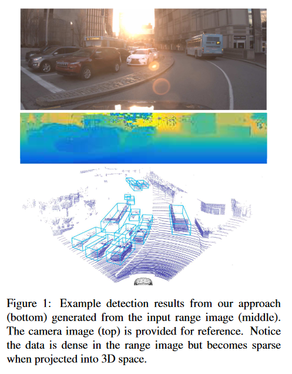

在相机图像中进行2D检测时，使用密集卷积方法可以获得高效且高性能的结果[19, 24]。虽然传感器的范围数据在很多方面与相机图像相似，但所需的输出是一个在3D空间中有方向的边界框。因此，3D目标检测器必须将传感器数据从范围视图（RV）转换为俯视图（也称为鸟瞰图，BEV）中的检测结果。大多数现有工作首先将范围测量投影到3D点，然后将3D空间离散化为体素，以便直接在输出空间中进行操作[27, 28, 17]。这些方法已经显示出令人印象深刻的结果，但需要在对稀疏输入数据进行操作，这可能会带来计算上的开销。还有一些工作直接在密集的RV表示上进行操作[5, 16]，但这些方法在性能上尚未达到BEV方法的标准。此外，还有一些工作将RV和BEV表示结合起来[5]。

这些表示方式各有优缺点。在范围视图中，传感器数据是密集的，但感知到的物体大小会随着距离而变化。在俯视图中，数据是稀疏的，但无论距离如何，物体的大小都保持不变。这种一致性为预测添加了很强的先验，使问题更容易学习。最后，范围视图保留了投影到俯视图时会丢失的遮挡信息。

在这项工作中，我们提出了一种有效的方法，以端到端的方式学习概率3D目标检测器。当有足够的训练数据时，我们以显著较低的运行时间实现了最先进的检测性能。我们的方法是高效的，因为我们使用了一个小而密集的范围图像，而不是一个大而稀疏的鸟瞰图像。我们提出的方法不仅为每个检测生成类别概率，而且还生成检测边界框上的概率分布。据我们所知，我们提出的方法是第一个通过建模边界框角的分布来捕获检测不确定性的方法。通过估计检测的准确性，我们的方法使全自动驾驶系统中的下游组件能够在具有不同程度不确定性的物体周围表现出不同的行为。

# <a href="zotero://open-pdf/library/items/K2WUP4NS?page=2">“2. Related Work”</a> (<a href="zotero://select/library/items/W8HVCIW7">Meyer 等, 2019, p. 12678</a>)

## <a href="zotero://open-pdf/library/items/K2WUP4NS?page=2">“2.1. 3D Object Detection”</a> (<a href="zotero://select/library/items/W8HVCIW7">Meyer 等, 2019, p. 12678</a>)

已经提出了多种基于深度学习的方法用于自动驾驶的3D对象检测。VeloFCN\[16]和MV3D\[5]提出了使用范围视图表示的方法。这两种方法都通过离散方位角和仰角来构造RV。在本文中，我们使用激光雷达的配置提出了一种不同的RV表示，并证明了它可以带来更好的性能。

VoxelNet [30]从每个3D体素的LiDAR点计算PointNet [23]样式的特征。之后，他们对这些体素进行3D卷积以产生检测结果。与体素化输入不同，我们的方法直接在原始范围数据上操作，并通过均值平移聚类聚合来自LiDAR点的预测结果，以生成检测结果。

与2D图像检测类似，3D方法可以分为两种元框架：区域提议方法和单次射击方法[19]。基于区域提议的方法[5,15,22]分两个阶段进行：第一阶段提出可能包含物体的合理区域，第二阶段从提出的区域中提取特征并利用它们产生检测结果。基于单次射击的方法[1,16,28,30]使用单阶段网络产生检测结果。在此工作中，我们使用单次射击方法，因为区域提议网络通常计算成本较高，并且最小化延迟对于实时自动系统至关重要。

除了使用LiDAR数据之外，一些先前的研究还使用图像[5,15,22,17,26,21,9]或高清地图[27]来改善检测结果。在本文中，我们只使用LiDAR数据，并将传感器融合留作未来的工作。一些方法[4,3,20,25]试图解决不使用来自LiDAR的范围数据的3D检测问题。然而，这些方法的准确性未达到基于LiDAR的方法的性能。

## <a href="zotero://open-pdf/library/items/K2WUP4NS?page=2">“2.2. Probabilistic Object Detection”</a> (<a href="zotero://select/library/items/W8HVCIW7">Meyer 等, 2019, p. 12678</a>)

大多数最先进的2D [24,19]和3D [5,15,27,17]目标检测方法为每个检测产生具有概率得分的单个框。虽然这个概率涵盖了存在和语义的不确定性，但它并不能准确衡量定位的不确定性。最近，[12]提出明确预测每个2D检测与真实标签的交并比（IoU）。他们使用预测的IoU来优化和评估检测结果。估计IoU提供了衡量检测定位误差的指标。在本文中，我们估计框检测的概率分布，而不仅仅是均值，预测分布的方差表示框角位置的不确定性的大小。

[13]中的开创性工作研究了用于多个计算机视觉任务的贝叶斯深度网络。基于这项工作，[6,7]在3D目标检测中产生并分析了认识不确定性和随机不确定性。然而，他们没有使用预测的不确定性来显着提高检测器的性能。在本文中，我们专注于通过预测框检测的概率分布来估计随机不确定性，并且我们利用预测的分布来合并和优化我们的检测结果。我们的方法没有估计认识不确定性，因为它目前无法高效计算。

# <a href="zotero://open-pdf/library/items/K2WUP4NS?page=3">“3. Proposed Method”</a> (<a href="zotero://select/library/items/W8HVCIW7">Meyer 等, 2019, p. 12679</a>)

我们提出的方法概述如图2所示。以下各部分详细描述了每个步骤。

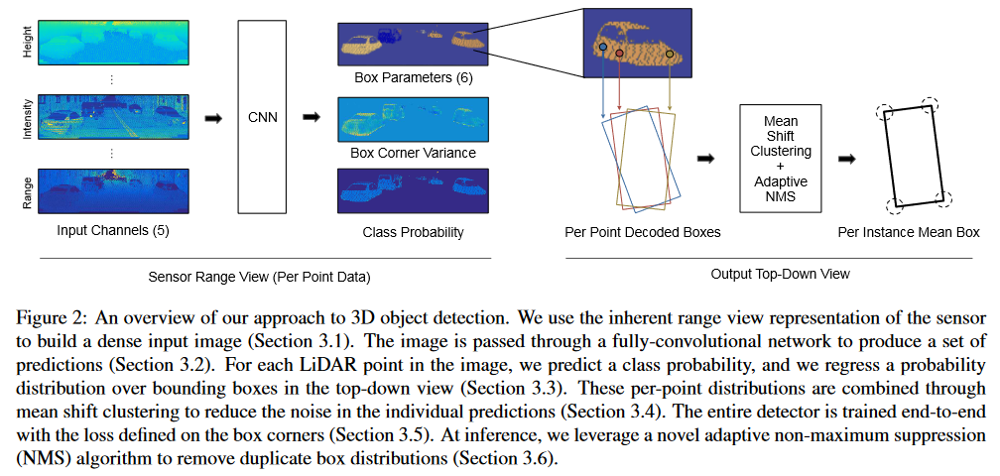

## <a href="zotero://open-pdf/library/items/K2WUP4NS?page=3">“3.1. Input Representation”</a> (<a href="zotero://select/library/items/W8HVCIW7">Meyer 等, 2019, p. 12679</a>)

LiDAR通过一组激光器扫描环境，产生一个圆柱形范围图像。图像的水平分辨率由旋转速度和激光脉冲速率决定，而垂直分辨率由激光器的数量决定。64E LiDAR包含一组64个激光器，其垂直间距约为0.4◦且水平角分辨率约为0.2◦。对于扫描中的每个点，传感器提供范围r、反射率e、方位角θ和激光器id m，对应于已知的仰角。使用范围、方位角和仰角，我们可以计算出在传感器框架中相应的3D点（x，y，z）。我们将激光器id m直接映射到行并将方位角θ离散化为列来构建输入图像。如果同一单元格内存在多个点，我们保留最近的点。

对于图像中的每个单元格坐标，我们从其对应点收集一组输入通道：范围r、高度z、方位角θ、强度e和一个表示单元格是否包含点的标志。结果是一个五个通道的图像，作为我们网络的输入（如图2所示）。

## <a href="zotero://open-pdf/library/items/K2WUP4NS?page=3">“3.2. Network Architecture”</a> (<a href="zotero://select/library/items/W8HVCIW7">Meyer 等, 2019, p. 12679</a>)

我们的图像包含距离范围很广的物体，并且物体的大小可以从几千个点到单个点不等。我们利用深度层聚合网络架构[29]来有效地提取和组合多尺度特征。我们的网络是完全卷积的，由三个层次组成，如图3所示。每个层次的卷积核大小分别为64、64、128。

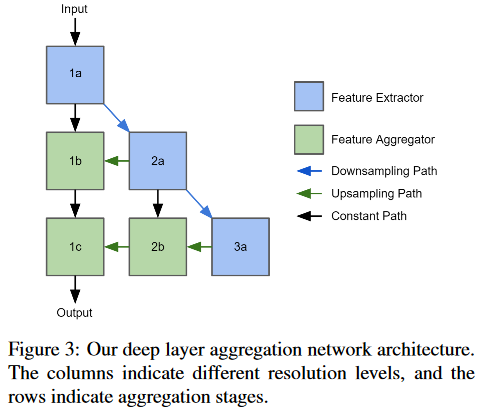

每个级别都包含一个特征提取模块和一定数量的特征聚合模块。这些模块的结构如图4所示。由于图像的水平分辨率远大于垂直分辨率，我们保持垂直分辨率不变，只在水平方向进行下采样和上采样。最后使用一个1×1卷积层将所得特征图转化为编码预测。

## <a href="zotero://open-pdf/library/items/K2WUP4NS?page=3">“3.3. Predictions”</a> (<a href="zotero://select/library/items/W8HVCIW7">Meyer 等, 2019, p. 12679</a>)

我们的网络被训练以预测图像中每个点的一组类概率。给定一个点位于一个物体上，网络预测一个可以封装该物体的包围框的概率分布。当观察到的数据不完整时，概率分布可以是多模态的，这种情况经常出现在长距离、点稀疏和存在遮挡时。因此，我们使用混合模型对概率分布进行建模，并训练网络来预测一组具有相应方差和混合权重的均值。网络学习的分布由损失函数定义，这将在第3.5节讨论。

对于自动驾驶应用，我们假设所有物体都位于同一水平面上；因此，我们可以通过其在x-y平面上的四个角来描述一个包围盒。图1中描绘的3D包围盒是使用假设的水平面和固定高度生成的。我们不是直接回归四个角，而是预测相对中心$(d_x,d_y)$、相对方向$(\omega_x,\omega_y)$和盒子尺寸$(l,w)$。我们计算盒子的绝对中心$b_c$和绝对方向$\phi$，如下所示：

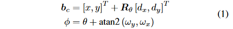

其中 (x, y) 和 θ 是 LiDAR 点的 2D 位置和方位角，Rθ 是由 θ 参数化的旋转矩阵。接下来，我们可以计算包围盒的四个角，

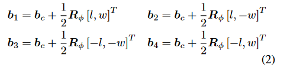

其中 $R_\phi$ 是由 $\phi$ 参数化的旋转矩阵。为了方便起见，我们将四个角连接成一个单独的向量 b = [b1, b2, b3, b4]。

为了简化预测概率分布，我们假设在x和y维度上具有均匀方差，并在所有四个角落共享方差。与[13]一样，我们训练网络来预测标准差的对数$s=log\ \sigma$。

总的来说，对于图像中的每个点，我们的网络预测一组类概率{pc}C c=1，其中C是除背景类之外的目标类别的数量。对于每个点和每个物体类，网络预测一组边界框参数$\{d_{x,k},d_{y,k},w_{x,k},w_{y,k}l_k,w_k\}^K_{k=1}$，一组对数标准差{sk}Kk=1，以及一组混合模型权重{αk}Kk=1，其中K是混合模型的组成部分的数量。

## <a href="zotero://open-pdf/library/items/K2WUP4NS?page=4">“3.4. Mean Shift Clustering”</a> (<a href="zotero://select/library/items/W8HVCIW7">Meyer 等, 2019, p. 12680</a>)

每个点独立预测边界框的分布；然而，同一物体上的点应该预测类似的分布。当然，个别预测将包含一定量的噪声。我们可以通过结合每点的预测来减少这种噪声，方法是通过均值漂移聚类。由于我们预测的分布是类相关的并且是多模态的，我们对每个物体类和混合模型的每个组件分别进行均值漂移。为了提高效率，我们在盒子的中心而不是盒子的角落进行均值漂移，这降低了问题的维度。此外，我们还提出了一个在二维情况下运行的均值漂移算法的快速近似方法。

我们的近似算法首先将自上而下的视图离散化为大小为∆x×∆y的网格。对于包含一个或多个盒子中心的每个网格i，我们通过对该网格中的所有中心取平均来创建一个初始均值mi。此外，我们记录了一组点Si，其盒子中心落在该网格内。我们按照以下方式迭代更新均值：

$$
m_i\leftarrow \frac{\sum_{j\in i\cup N_{(i)}}K_{i,j}(m_j\cdot |S_j|)}{\sum_{j\in i\cup N_{(i)}}K_{i,j}|S_j|} \quad (3)
$$

其中，

$$
K_{i,j}=exp(-\frac{{||m_i-m_j||}^2}{\Delta x^2+\Delta y^2}) \quad (4)
$$

其中N(i)是与第i个网格相邻的八个网格的集合。更新后，如果第i个均值现在落入第j个网格中，我们将i合并到j中，

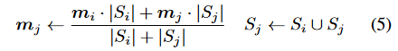

并将mi设为无效（mi ← 0）和清空Si（Si ← ∅）。

通过利用网格的规则结构，可以有效地计算方程(3)。通过构建一个网格张量并生成该张量的偏移版本，我们可以通过仅使用逐元素运算符同时更新所有均值。这种计算类型非常适合于图形处理单元(GPU)。

在执行固定数量的均值偏移迭代之后，对分配给同一聚类的每个点盒分布进行组合。具体来说，我们将聚类边界盒分布建模为每点分布的乘积。聚类概率分布的均值和方差为

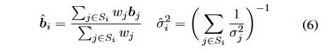

其中$w=1/\sigma^2$。每个点的预测边界框和方差被其聚类的边界框和方差所取代。在我们的实验中，我们执行三次均值漂移迭代，其中∆x = ∆y = 0.5米。

## <a href="zotero://open-pdf/library/items/K2WUP4NS?page=5">“3.5. End-to-end Training”</a> (<a href="zotero://select/library/items/W8HVCIW7">Meyer 等, 2019, p. 12681</a>)

从框参数到框角的映射，方程（1）和（2），以及合并边界框分布，方程（6），是可微的；因此，我们能够以端到端的方式训练网络。

对于图像中的每个点，我们使用多类交叉熵损失$\mathcal{L}_{prob}$来学习类概率$\{p_c\}^C_{c=1}$。为了处理类别不平衡问题，我们采用焦点损失[18]，它是交叉熵损失的修改版本。整个图像的分类损失定义如下：

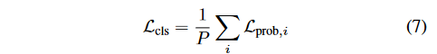

其中$\mathcal{L}_{prob,i}$是图像中第i个点的损失，P是图像中的点的总数。

对于物体上的每个点，我们首先确定哪个组件与真实情况最匹配，从而学习该物体的混合模型的参数，

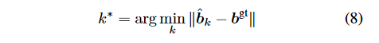

其中，$\hat{b}_k$是混合模型的第k个均值组件，而$b^{gt}$是相应的真实边界框。然后，我们按照[13]中提出的方法更新k∗组件的参数，

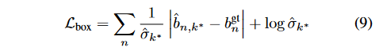

其中，$\hat{b}_{n,k^*}$是$\hat{b}_{k^*}$的第n个元素，而$b^{gt}_n$是相应的真实值。如[13]中所讨论的，该损失在所学分布上施加了拉普拉斯先验。接下来，我们再次使用多类交叉熵损失Lmix来更新混合权重${\alpha_k}^K_{k=1}$，其中正标签对应于k∗组件。仅更新与地面真实情况最匹配的预测这一思想最初是在[10]中提出的，作为多选择学习的后见之明损失。整个图像的回归损失定义如下：

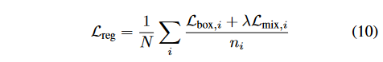

其中，$\mathcal{L}_{box,i}$和$\mathcal{L}_{mix,i}$是图像中第i个点的损失，该点位于物体上，ni是与第i个点位于同一物体上的点的总数，N是图像中物体的总数，λ是这两种损失的相对权重。对于所有实验，我们将λ设置为0.25。图像的总损失$\mathcal{L}_{total}=\mathcal{L}_{cls}+\mathcal{L}_{reg}$。

## <a href="zotero://open-pdf/library/items/K2WUP4NS?page=5">“3.6. Adaptive Non-Maximum Suppression”</a> (<a href="zotero://select/library/items/W8HVCIW7">Meyer 等, 2019, p. 12681</a>)

在推断阶段，我们通过对预测的类别概率 pc 进行阈值处理来确定属于某个对象类别的点，我们在所有实验中使用的阈值是 1/C。如前所述，对象上的每个点都预测了一个边界框的概率分布。对于每个预测的分布，我们提取与混合模型均值对应的一组边界框。

通常会执行非极大值抑制（NMS）来删除多余的边界框。标准的过程是识别具有交并比（IoU）大于固定阈值的边界框，并删除类概率较低的边界框。这种策略对我们的方法来说是不适当的，有两个原因。首先，它没有考虑边界框的预测方差。其次，在我们的情况下，类别概率并不表示边界框的质量。例如，将半卡车的前部分类为车辆相对容易，但准确预测其范围却很困难。

作为替代，我们提出了一种自适应NMS算法，该算法使用预测的方差来确定一对边界框的适当IoU阈值。此外，我们利用边界框的似然性作为其得分。由于我们使用混合模型的均值，与混合模型的第k个分量对应的边界框的似然性简化为$\alpha_k/2\hat{\sigma}_k$。

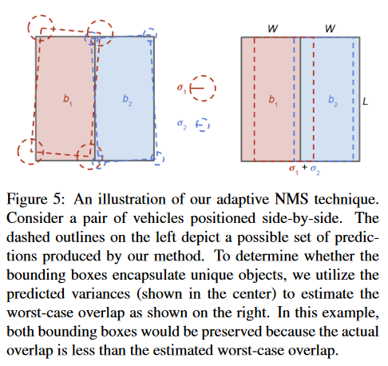

在俯视图中，边界框不应该重叠；然而，由于预测的不确定性，一定程度的重叠是可以预期的。对于来自相同类别的重叠边界框的每一对，我们计算给定它们预测的方差的IoU的上界。我们通过假设最坏情况来实现这一点，即当两个具有相同尺寸的对象并排时，如图5所示。在这种情况下，最大允许的IoU t 应该是：

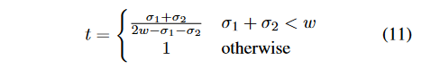

其中，w 是对象边界框的平均宽度。例如，对于车辆，w ≈ 2米。

如果一对边界框的IoU超过最大阈值，那么要么其中一个预测的边界框是错误的，要么其中一个预测的方差是错误的。假设边界框是错误的，我们可以移除具有较低似然性的边界框。否则，我们可以假设方差是不准确的，并增加较不可能的边界框的方差，使得 t 等于观察到的 IoU。前者称为硬NMS，而后者类似于Soft NMS \[2]。这种选择的影响在第4.2节的消融研究中进行了考察。

# <a href="zotero://open-pdf/library/items/K2WUP4NS?page=6">“4. Experiments”</a> (<a href="zotero://select/library/items/W8HVCIW7">Meyer 等, 2019, p. 12682</a>)

我们提出的方法在两个数据集上进行了评估和与最先进的方法进行了比较：大规模的ATG4D目标检测数据集和小规模的KITTI目标检测基准 \[8]。

## <a href="zotero://open-pdf/library/items/K2WUP4NS?page=6">“4.1. Evaluation on ATG4D”</a> (<a href="zotero://select/library/items/W8HVCIW7">Meyer 等, 2019, p. 12682</a>)

ATG4D数据集包含5,000个用于训练的序列和500个用于验证的序列。来自训练集的序列以10 Hz的速度采样，而验证集以0.5 Hz的速度采样。整个数据集包含120万个训练扫描和5,969个验证扫描。所有扫描都是使用Velodyne 64E激光雷达捕获的。我们采用与KITTI基准相同的评估程序，并仅考虑传感器前90°视场内且距离不超过70米的检测。因此，我们的范围图像仅包含激光雷达数据的这个前部分，其尺寸为512 × 64。

网络使用Adam优化器\[14]进行了300,000次迭代的训练，学习率为0.002，每150次迭代以0.99的速率指数衰减。我们使用了一个分布在32个GPU上的批量大小为128的训练。对于车辆，我们学习了一个具有三个分量（K = 3）的多模态分布，而对于行人和自行车，我们学习了一个单模态分布（K = 1）。

表1显示了我们在验证集上的结果，与其他最先进的方法进行了比较。与KITTI基准一样，我们计算了车辆的IoU为0.7时的平均精度（AP），以及自行车和行人的IoU为0.5时的平均精度（AP）。在这个数据集上，我们的方法在0-70米的范围内表现优于现有的最先进方法。此外，我们的方法在所有范围内都优于仅使用LiDAR的方法，只有在长距离上，具有额外图像数据的LiDAR+RGB方法才能超过我们的方法，这里额外的图像数据提供了最大的价值。我们认为我们的方法在行人方面表现得更好，因为我们的范围视图表示没有将输入数据离散化为体素。

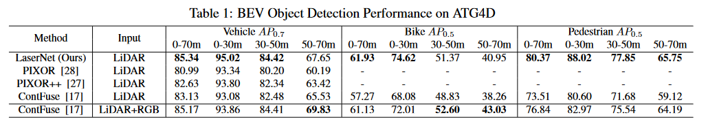

## <a href="zotero://open-pdf/library/items/K2WUP4NS?page=6">“4.2. Ablation Study on ATG4D”</a> (<a href="zotero://select/library/items/W8HVCIW7">Meyer 等, 2019, p. 12682</a>)

在本节中，我们研究了我们提出的方法的各个方面及其对车辆检测性能的影响。我们在ATG4D数据集上进行了消融研究，结果如表2所示。下面提供了对该研究的详细描述。

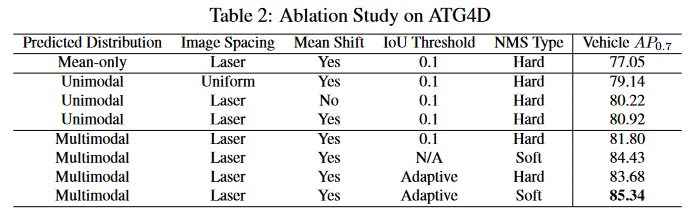

**预测概率分布** 最大的改进是通过预测边界框的分布而不仅仅是均值。当仅预测均值边界框时，方程（6）变为简单平均，方程（9）简化为ℓ1损失对于边界框的角点。此外，在这种情况下，边界框的分数是类别概率。我们认为性能下降是由于概率与边界框的准确性之间关联不好。

**图像形成** 以前利用范围视图的方法\[5, 16]均匀将俯仰角离散为行。然而，Velodyne 64E激光雷达中的激光并不是均匀分布的。通过使用激光ID将点映射到行，并直接处理传感器捕获的数据，可以提高性能。

**非极大值抑制** 当激光雷达点稀疏时，可能存在多个边界框配置可以解释观察到的数据。通过在每个点处预测多模态分布，我们可以进一步提高我们方法的召回率。在产生多模态分布时，使用严格的阈值进行NMS是不合适的，因为只有最有可能的边界框会保留下来。作为替代，我们可以使用软NMS \[2]重新加权置信度而不是消除边界框，但这破坏了我们对置信度的概率解释。通过利用我们的自适应NMS算法，我们保持了概率解释并获得更好的性能。

## <a href="zotero://open-pdf/library/items/K2WUP4NS?page=7">“4.3. Runtime Evaluation”</a> (<a href="zotero://select/library/items/W8HVCIW7">Meyer 等, 2019, p. 12683</a>)

对于自动驾驶而言，运行时性能同样重要。表3比较了我们的方法（在NVIDIA 1080Ti GPU上测得）与KITTI上现有方法之间的运行时性能。前向传播指运行网络所需的时间，而总时间包括前后处理以及前向传播。我们提出的方法比最快的最先进方法快两倍。我们能够实现更快的运行时性能，因为我们操作的是一个小而密集的范围视图图像，而不是一个大而稀疏的鸟瞰图表示。

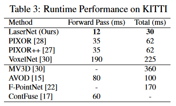

## <a href="zotero://open-pdf/library/items/K2WUP4NS?page=7">“4.4. Evaluation on KITTI”</a> (<a href="zotero://select/library/items/W8HVCIW7">Meyer 等, 2019, p. 12683</a>)

KITTI目标检测基准 \[8] 包含由Velodyne 64E激光雷达捕获的7,481个训练扫描和7,518个测试扫描。对于训练集，LiDAR的前90°视场内提供了大约70米的物体注释。

为了训练我们的网络，我们使用了训练集中的5,985个扫描，剩余的扫描用于验证。我们以相同的学习计划对网络进行50,000次迭代的训练，使用单个GPU的批量大小为12。为了帮助避免在这个小训练集上过拟合，我们使用了数据增强。我们随机翻转了范围图像，并在水平维度上应用随机像素偏移。

在这样一个小的数据集上学习概率分布，尤其是多模态分布，对于边界框来说是困难的。因此，我们训练网络仅检测车辆，并预测边界框上的单模态概率分布。

KITTI评估服务器在三个难度级别上计算0.7 IoU的AP：easy，moderate和hard。如表4所示，我们的方法在这个小数据集上表现不如当前最先进的鸟瞰图检测器。下一节将探讨在表1中显示的大数据集上的结果与小KITTI数据集上的结果之间性能差异的原因。

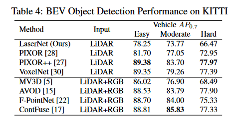

## <a href="zotero://open-pdf/library/items/K2WUP4NS?page=8">“4.5. Analysis of the Predicted Distribution”</a> (<a href="zotero://select/library/items/W8HVCIW7">Meyer 等, 2019, p. 12684</a>)

在小数据集上，与最先进的方法相比，我们的方法表现不佳。而在一个显著更大的数据集上，我们的方法胜过以前的工作。第4.2节中的消融研究强调了对我们方法的成功实现估计概率分布的重要性。如果网络无法准确学习这个分布，我们的方法将表现不佳。

为了评估学习模型预测的分布的质量，我们计算每个地面真实标签在我们预测的概率分布下的概率，并绘制如图6所示的预期CDF与观察到的CDF。我们在KITTI和ATG4D数据集上进行这个评估。在这两个数据集上，模型被训练以预测单模态概率分布。在小规模的KITTI数据集上，我们的模型无法正确估计概率分布。然而，在大规模的ATG4D数据集上，该模型能够精确地学习分布。我们假设学习分布需要网络看到比KITTI训练集中提供的更多的示例，这有助于解释这两个数据集上模型性能的差异。

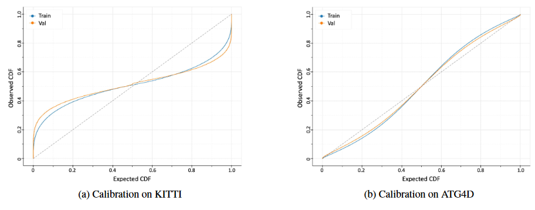

# <a href="zotero://open-pdf/library/items/K2WUP4NS?page=8">“5. Discussion”</a> (<a href="zotero://select/library/items/W8HVCIW7">Meyer 等, 2019, p. 12684</a>)

近年来，研究界普遍偏向于在鸟瞰图或直接在3D点云上运行的检测器。这些方法有许多优势。直接在输出空间中操作使得检测器对物体的形状有一致的先验知识，这可以使学习问题变得更容易。这在训练较小的数据集时尤为重要。

然而，我们认为忽视鸟瞰图表示是一个错误。在许多领域，深度学习方法在原始输入数据上应用时，没有手工设计的特征提取、投影或其他操作，只要有足够的训练数据，就一直显示出成功。鸟瞰图是LiDAR数据的本机表示；因此，它自然而紧凑。这种紧凑的表示导致了显著的效率提升。此外，它本质上传达了有关数据捕获方式的重要背景信息，而在将距离数据投影到点云时，这种上下文可能会丢失。与此同时，鸟瞰图对学习提出了重大挑战，因为物体的尺度和形状各异，而且需要处理遮挡。通过大量的训练集，我们已经证明了有可能克服这些挑战，产生具有更高计算效率的竞争性结果。

在较小的数据集上，我们的方法没有达到与最先进的鸟瞰图检测器相同的性能。我们方法的关键要素包括在传感器的本机视图中进行操作，并对边界框预测概率分布。这两者使得学习问题变得更加复杂，需要更多的训练数据才能表现良好。

最后，虽然本文着重于一个特定的表示方法，但我们认为其他检测方法也将受益于对边界框预测概率分布的方法。

