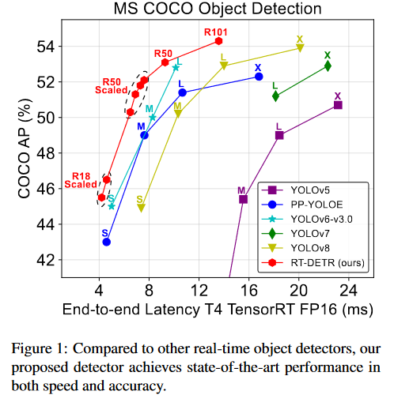
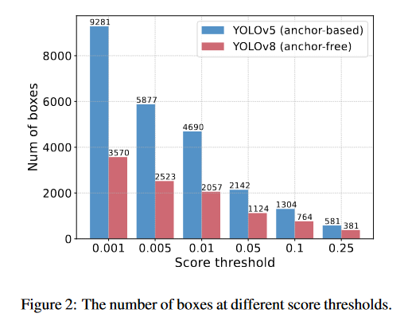
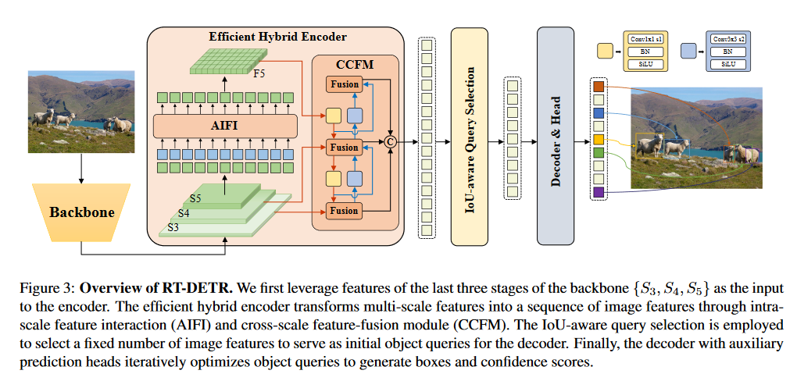
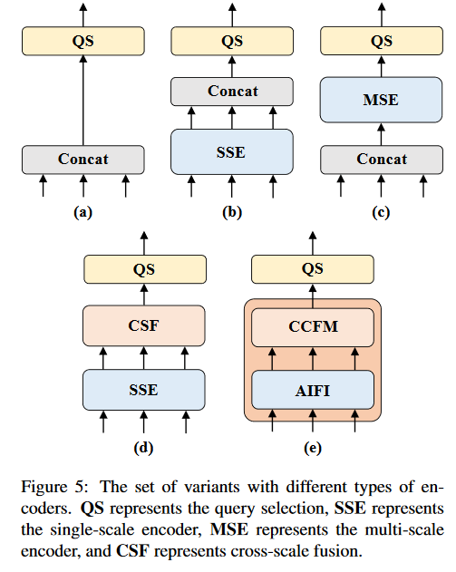
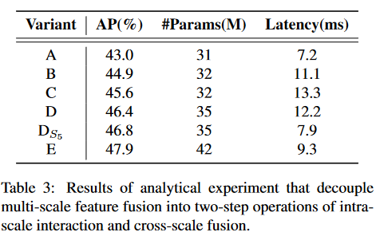
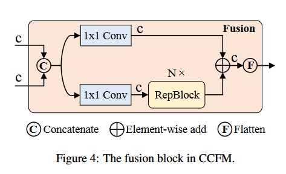
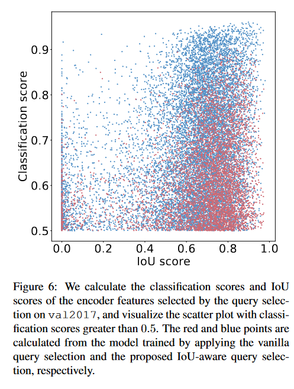
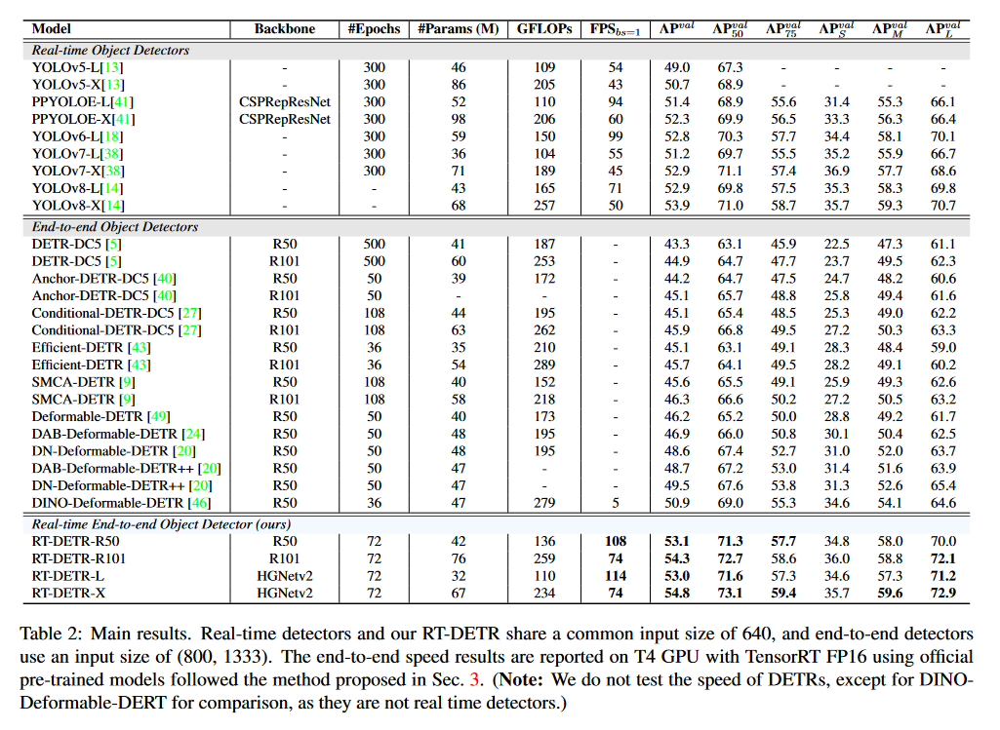
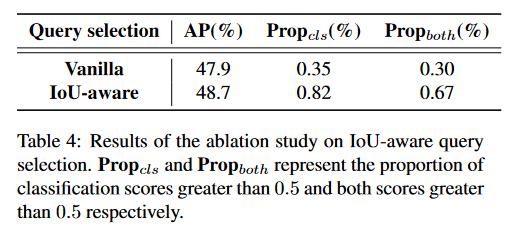
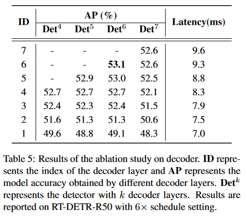

[《目标检测》-第33章-浅析RT-DETR - 知乎 (zhihu.com)](https://zhuanlan.zhihu.com/p/626659049)

# Abstract

最近，基于端到端transformer的检测器（DETRs）取得了显著的性能。然而，DETRs 的高计算成本限制了它们的实际应用，并阻止它们充分利用无后处理（如非最大抑制）的优势。在本文中，我们首先分析了非最大抑制对现有实时目标检测器准确性和速度的负面影响，并建立了一个端到端速度基准。为了解决上述问题，我们提出了一种实时检测变压器（RT-DETR），据我们所知，这是第一个实时端到端目标检测器。具体而言，我们设计了一个高效的混合编码器，通过分解内部尺度交互和跨尺度融合来高效处理多尺度特征，并提出了IoU感知的查询选择，通过为解码器提供更高质量的初始物体查询，进一步提高性能。此外，我们提出的检测器支持使用不同的解码器层进行推断速度的灵活调整，无需重新训练，从而方便在各种实时场景中的实际应用。我们的RT-DETR-L 在 COCO val2017 上取得了 53.0% 的 AP 和 T4 GPU 上的 114 FPS，而 RT-DETR-X 取得了 54.8% 的 AP 和 74 FPS，在速度和准确性上均优于同样规模的最先进的 YOLO 检测器。此外，我们的RT-DETR-R50 实现了 53.1% 的 AP 和 108 FPS，准确性比 DINO-DeformableDETR-R50 高出 2.2 %，FPS 大约提高了 21 倍。源代码和预训练模型可在 https\://github.com/lyuwenyu/RT-DETR 获取。

# <a href="zotero://open-pdf/library/items/N57EDPAH?page=1">“1. Introduction”</a> (<a href="zotero://select/library/items/B2XM9DSL">Lv 等, 2023, p. 1</a>)

物体检测是一项基本的视觉任务，涉及识别图像中的物体并定位它们。现代物体检测器有两种典型的架构：基于CNN的和基于Transformer的。在过去的几年里，人们对基于CNN的物体检测器进行了广泛的研究。这些检测器的架构已经从最初的两阶段[12,30,4]发展到一阶段[23,36,1,13,26,17,41,18,10,38,14]，并出现了两种检测范式，基于锚点的[23,26,17,13,38]和无锚点的[36,10,41,18,14]。这些研究在检测速度和准确性方面都取得了显著进展。基于Transformer的物体检测器(DETRs)[5,34,39,49,27,40,24,20,46,6]自提出以来就受到了学术界的广泛关注，因为它消除了各种手工制作的组件，例如非最大抑制(NMS)。这种架构极大地简化了物体检测的流程，实现了端到端的物体检测。

实时物体检测是一个重要的研究领域，具有广泛的应用，如物体跟踪[45,48]、视频监控[28]、自动驾驶[2,44]等。现有的实时检测器通常采用基于CNN的架构，在检测速度和准确性之间实现了合理的折衷。然而，这些实时检测器通常需要NMS进行后处理，这通常很难优化并且不够鲁棒，导致检测器的推理速度延迟。最近，由于研究人员在加速训练收敛和降低优化难度方面的努力，基于Transformer的检测器取得了显着的性能。然而，DETR的计算成本高的问题尚未得到有效解决，这限制了DETR的实际应用，并导致无法充分利用其优势。这意味着尽管物体检测管道被简化了，但由于模型本身的计算成本高，很难实现实时物体检测。上述问题自然促使我们考虑是否可以将DETR扩展到实时场景，充分利用端到端检测器来避免NMS对实时检测器造成的延迟。

为实现上述目标，我们重新思考了DETR，并对其关键组件进行了详细的分析和实验，以减少不必要的计算冗余。具体来说，我们发现尽管引入多尺度特征有利于加速训练收敛和提高性能[49]，但它也导致输入到编码器的序列长度显著增加。因此，由于计算成本高，transformer编码器成为了模型的计算瓶颈。为实现实时物体检测，我们设计了一个高效的混合编码器来替换原始的transformer编码器。通过解耦多尺度特征的同尺度交互和跨尺度融合，编码器可以高效地处理不同尺度的特征。此外，以前的工作[40,24]表明，解码器的对象查询初始化方案对检测性能至关重要。为了进一步提高性能，我们提出了IoU-aware查询选择，通过在训练过程中提供IoU约束，为解码器提供更高质量的初始对象查询。此外，我们提出的检测器支持通过使用不同的解码器层灵活调整推理速度，无需重新训练，这得益于DETR架构中解码器的设计，有利于实时检测器的实际应用。

该论文提出了一种实时检测Transformer（RT-DETR），据我们所知，这是第一个实时的端到端对象检测器。RT-DETR不仅在准确性和速度方面优于当前最先进的实时检测器，而且不需要后处理，因此检测器的推理速度没有延迟并保持稳定，充分利用了端到端检测管道的优势。我们提出的RT-DETRL在COCO val2017上达到了53.0%的AP，在NVIDIA Tesla T4 GPU上达到了114 FPS，而RT-DETR-X达到了54.8%的AP和74 FPS，在速度和准确性方面都优于同规模的当前最先进的YOLO检测器。因此，我们的RT-DETR成为了实时对象检测的新的最先进的技术，如图1所示。此外，我们提出的RT-DETR-R50达到了53.1%的AP和108 FPS，而RT-DETR-R101达到了54.3%的AP和74 FPS。其中，RT-DETR-R50在准确性上比DINO-Deformable-DETR-R50高出2.2%的AP（53.1%的AP比50.9%的AP），在FPS上高出约21倍（108 FPS比5 FPS）。

本文的主要贡献总结如下：（i）我们提出了第一个实时端到端目标检测器，该检测器不仅在速度和准确性上超越了当前最先进的实时检测器，而且不需要后处理，因此其推理速度不会延迟并保持稳定；（ii）我们详细分析了NMS对实时检测器的影响，并从后处理角度得出关于当前实时检测器的结论；（iii）我们的工作为当前端到端检测器的实时实现提供了一个可行的解决方案，所提出的检测器可以通过使用不同的解码器层来灵活调整推理速度，而无需重新训练，这在现有的实时检测器中是难以实现的。

# <a href="zotero://open-pdf/library/items/N57EDPAH?page=2">“2. Related work”</a> (<a href="zotero://select/library/items/B2XM9DSL">Lv 等, 2023, p. 2</a>)

## <a href="zotero://open-pdf/library/items/N57EDPAH?page=2">“2.1. Real-time Object Detectors.”</a> (<a href="zotero://select/library/items/B2XM9DSL">Lv 等, 2023, p. 2</a>)

多年来，YOLO系列\[29, 1, 37, 26, 17, 13, 10, 41, 18, 38, 14]经过持续的发展，已成为实时物体检测器的代名词，可以粗略地分为两类：基于锚点的\[29, 1, 37, 13, 38]和无锚点的\[10, 41, 18, 14]。从这些检测器的性能来看，锚点不再是制约YOLO发展的主要因素。然而，上述检测器会产生大量冗余的边界框，需要在后处理阶段利用NMS进行过滤。不幸的是，这导致性能瓶颈，并且NMS的超参数对检测器的准确性和速度有重要影响。我们认为这与实时物体检测器的设计理念不兼容。

## <a href="zotero://open-pdf/library/items/N57EDPAH?page=2">“2.2. End-to-end Object Detectors.”</a> (<a href="zotero://select/library/items/B2XM9DSL">Lv 等, 2023, p. 2</a>)

端到端的目标检测器[5、34、39、49、27、40、24、20、46、6]以其简化的管道而闻名。Carion等人[5]首次提出了基于Transformer的端到端目标检测器，名为DETR（DEtection TRansformer）。它因其独特的特性而吸引了大量的关注。特别是，DETR消除了传统检测管道中的手工设计的锚点和NMS组件。相反，它采用二部匹配并直接预测一对一的对象集。通过这种策略，DETR简化了检测流程，并缓解了由NMS引起的性能瓶颈。尽管DETR具有明显的优势，但它仍然存在两个主要问题：训练收敛缓慢和查询难以优化。为了解决这些问题，已经提出了许多DETR变体。具体来说，Deformable-DETR[49]通过提高注意力机制的效率，利用多尺度特征加速了训练收敛。Conditional DETR[27]和Anchor DETR[40]降低了查询的优化难度。DAB-DETR[24]引入了4D参考点，并逐层迭代优化预测框。DN-DETR[20]通过引入查询去噪来加速训练收敛。Group-DETR[6]通过引入组对多分配来加速训练。DINO[46]建立在以前的工作基础上，并达到了最先进的结果。尽管我们不断改进DETR的组件，但我们的目标不仅是进一步提高性能，而且要创建一个实时的端到端目标检测器。

## <a href="zotero://open-pdf/library/items/N57EDPAH?page=3">“2.3. Multi-scale Features for Object Detection.”</a> (<a href="zotero://select/library/items/B2XM9DSL">Lv 等, 2023, p. 3</a>)

现代物体检测器已经证明了利用多尺度特征来提高性能的重要性，尤其是对于小物体。FPN \[22]引入了一个特征金字塔网络，融合了相邻尺度的特征。随后的研究\[25, 11, 35, 13, 18, 38, 14]扩展和增强了这一结构，并广泛应用于实时物体检测器中。Zhu等人\[49]首次将多尺度特征引入DETR，并改进了其性能和收敛速度，但这也导致DETR的计算成本显著增加。虽然可变形注意机制在一定程度上减轻了计算成本，但多尺度特征的融合仍然导致了很高的计算负担。为了解决这个问题，一些研究尝试设计计算高效的DETR。Efficient DETR \[43]通过使用密集先验初始化对象查询，降低了编码器和解码器层数。Sparse DETR \[32]有选择性地更新预计被解码器引用的编码器标记，从而降低了计算开销。Lite DETR \[19]通过以交替的方式减少低层特征的更新频率来增强编码器的效率。虽然这些研究已经降低了DETR的计算成本，但这些工作的目标并不是将DETR推广为实时检测器。

# <a href="zotero://open-pdf/library/items/N57EDPAH?page=3">“3. End-to-end Speed of Detectors”</a> (<a href="zotero://select/library/items/B2XM9DSL">Lv 等, 2023, p. 3</a>)

## <a href="zotero://open-pdf/library/items/N57EDPAH?page=3">“3.1. Analysis of NMS”</a> (<a href="zotero://select/library/items/B2XM9DSL">Lv 等, 2023, p. 3</a>)

非极大值抑制(NMS)是目标检测中广泛采用的后处理算法，用于消除检测器输出的重叠预测框。NMS需要两个超参数：得分阈值和IoU阈值。特别地，得分低于得分阈值的预测框将被直接过滤掉，每当两个预测框的IoU超过IoU阈值时，分数较低的框将被丢弃。这个过程反复进行，直到每个类别的所有框都被处理过。因此，NMS的执行时间主要取决于输入预测框的数量和两个超参数。

为了验证这一观点，我们利用YOLOv5（基于锚点）和YOLOv8（无锚点）进行实验。首先，我们计算在输出框被不同阈值过滤后剩余的预测框数量。我们从0.001到0.25选取一些分数作为阈值，计算两个检测器剩余的预测框数量，并将其绘制成直方图，直观地反映出NMS易受超参数的影响，如图2所示。此外，以YOLOv8为例，我们评估了模型在COCO val2017上的准确性以及在不同NMS超参数下NMS操作的执行时间。请注意，我们在实验中采用NMS后处理操作是TensorRT efficientNMSPlugin，涉及多个CUDA内核，包括EfficientNMSFilter、RadixSort、EfficientNMS等，我们只报告EfficientNMS内核的执行时间。我们在T4 GPU上测试了速度，上述实验中的输入图像和预处理是一致的。我们使用的超参数和相应的结果如表1所示。

## <a href="zotero://open-pdf/library/items/N57EDPAH?page=4">“3.2. End-to-end Speed Benchmark”</a> (<a href="zotero://select/library/items/B2XM9DSL">Lv 等, 2023, p. 4</a>)

为了公平比较各种实时检测器的端到端推理速度，我们建立了一个端到端速度测试基准。考虑到NMS的执行时间可能受到输入图像的影响，因此有必要选择一个基准数据集并计算多个图像的平均执行时间。该基准采用COCO val2017作为默认数据集，并为需要后处理的实时检测器附加TensorRT的NMS后处理插件。具体来说，我们根据基准数据集上相应准确率的超参数测试检测器的平均推理时间，并排除IO和内存复制操作。我们利用这个基准来测试基于锚点的检测器YOLOv5[13]和YOLOv7[38]，以及无锚点检测器PP-YOLOE[41]、YOLOv6[18]和YOLOv8[14]在T4 GPU上的端到端速度。测试结果如表2所示。根据结果，我们得出结论，对于需要NMS后处理的实时检测器，在等效精度下，无锚点检测器优于基于锚点的检测器，因为前者比后者需要的后处理时间少得多，这在以前的工作中被忽视了。这种现象的原因是，基于锚点的检测器产生的预测框比无锚点检测器多（在我们测试的检测器中多出三倍）。

# <a href="zotero://open-pdf/library/items/N57EDPAH?page=4">“4. The Real-time DETR”</a> (<a href="zotero://select/library/items/B2XM9DSL">Lv 等, 2023, p. 4</a>)

## <a href="zotero://open-pdf/library/items/N57EDPAH?page=4">“4.1. Model Overview”</a> (<a href="zotero://select/library/items/B2XM9DSL">Lv 等, 2023, p. 4</a>)

RT-DETR的提出包括一个骨干网络、一个混合编码器和一个带有辅助预测头的Transformer解码器。模型架构的概述在图3中有所描述。具体而言，我们利用骨干网络最后三个阶段的输出特征{S3，S4，S5}作为编码器的输入。混合编码器通过内部尺度交互和跨尺度融合将多尺度特征转化成图像特征序列（在第4.2节中描述）。随后，使用IoU感知查询选择从编码器输出序列中选择固定数量的图像特征作为解码器的初始对象查询（在第4.3节中描述）。最后，带有辅助预测头的解码器通过迭代优化对象查询来生成边界框和置信度得分。

## <a href="zotero://open-pdf/library/items/N57EDPAH?page=5">“4.2. Efficient Hybrid Encoder”</a> (<a href="zotero://select/library/items/B2XM9DSL">Lv 等, 2023, p. 5</a>)

计算瓶颈分析。为了加快训练收敛和提高性能，朱等人建议引入多尺度特征，并提出了可变形注意力机制来减少计算量。然而，尽管注意力机制的改进减少了计算开销，但输入序列长度的急剧增加仍然导致编码器成为计算瓶颈，阻碍了DETR的实时实现。据\[21]报道，编码器占Deformable-DETR中GFLOPs的49％，但仅对AP贡献了11％。为了克服这个障碍，我们分析了多尺度变换器编码器中存在的计算冗余，并设计了一组变体来证明尺度内和跨尺度特征的同时交互在计算上是低效的。

高层特征是从包含图像中对象丰富语义信息的低层特征中提取出来的。直观地说，在连接多尺度特征上执行特征交互是多余的。为了验证这一观点，我们重新思考了编码器结构，并设计了一系列具有不同编码器的变体，如图5所示。这组变体通过将多尺度特征交互解耦为两步操作（尺度内交互和跨尺度融合），逐渐提高了模型的准确性，同时显著降低了计算成本（详细指标参见表3）。我们首先将DINO-R50 \[46]中的多尺度变压器编码器作为基线A进行移除。接下来，根据基线A插入了不同形式的编码器，产生了一系列基于基线A的变体，具体如下解释：

• A → B: 变体 B 插入了一个单尺度变压器编码器，使用一个变压器块的层。每个尺度的特征共享编码器进行尺度内特征交互，然后连接输出的多尺度特征。

• B → C: 变体 C 在 B 的基础上引入了基于跨尺度的特征融合，并将连接的多尺度特征馈送到编码器执行特征交互。

• C → D: 变体 D 解耦了多尺度特征的尺度内交互和跨尺度融合。首先，使用单尺度变压器编码器执行尺度内交互，然后利用类似于 PANet \[25] 的结构执行跨尺度融合。

• D → E: 变体 E 在 D 的基础上进一步优化了多尺度特征的尺度内交互和跨尺度融合，采用了我们设计的高效混合编码器（详见下文）。

混合设计。基于以上分析，我们重新思考了编码器的结构并提出了一种新颖的高效混合编码器。如图3所示，所提出的编码器由两个模块组成，即基于注意力的尺度内特征交互（AIFI）模块和基于卷积神经网络的跨尺度特征融合模块（CCFM）。AIFI在变体D的基础上进一步减少了计算冗余，仅在S5上执行尺度内交互。我们认为将自注意力操作应用于具有更丰富语义概念的高级特征可以捕捉图像中概念实体之间的连接，从而有助于后续模块对图像中对象的检测和识别。与此同时，由于低级特征缺乏语义概念并且存在与高级特征交互时的重复和混淆的风险，对低级特征进行尺度内交互是不必要的。为验证这一观点，我们在变体D中仅对S5进行尺度内交互，实验结果报告在表3中，见DS5行。与普通的变体D相比，DS5显著减少了延迟（快了35%），但在准确性上提高了0.4%的平均精度（AP）。这个结论对于实时检测器的设计至关重要。CCFM也是基于变体D进行优化的，插入了由卷积层组成的若干融合块到融合路径中。融合块的作用是将相邻的特征融合成一个新的特征，其结构如图4所示。融合块包含N个RepBlocks，通过逐元素相加融合两个路径的输出。我们可以将这个过程公式化如下：

$$
Q=K=V=Flatten(S_5)\\
F_5=Reshape(Attn(Q,K,V))\\
Output=CCFM(\{S_3,S_4,F_5 \})
$$

其中，Attn表示多头自注意力，Reshape表示将特征的形状恢复为与S5相同，这是Flatten的逆操作。

## <a href="zotero://open-pdf/library/items/N57EDPAH?page=6">“4.3. IoU-aware Query Selection”</a> (<a href="zotero://select/library/items/B2XM9DSL">Lv 等, 2023, p. 6</a>)

DETR中的目标查询是一组可学习的嵌入，由解码器进行优化，并通过预测头映射到分类分数和边界框。然而，这些目标查询很难解释和优化，因为它们没有明确的物理含义。随后的研究工作\[40, 24, 49, 43, 46]改进了目标查询的初始化，并将其扩展到内容查询和位置查询（锚点）。其中，\[49, 43, 46]都提出了查询选择方案，它们的共同之处在于利用分类分数从编码器中选择前K个特征来初始化目标查询（或仅位置查询\[46]）。然而，由于分类分数和位置置信度的不一致分布，一些预测的框具有较高的分类分数但不接近真实框，导致选择了具有高分类分数和低IoU分数的框，而将具有低分类分数和高IoU分数的框丢弃。这损害了检测器的性能。为解决这个问题，我们提出了IoU感知的查询选择，通过在训练期间限制模型在高IoU分数的特征上产生高分类分数，并在低IoU分数的特征上产生低分类分数。因此，模型根据分类分数选择的前K个编码器特征对应的预测框既具有高分类分数又具有高IoU分数。我们重新制定检测器的优化目标如下：

$$
\begin{aligned}
\mathcal{L}(\hat{y},y)& =\mathcal{L}_{box}(\hat{b},b)+\mathcal{L}_{cls}(\hat{c},\textcolor{red}{\hat{b}},y,\textcolor{red}{b})\\
& =\mathcal{L}_{box}(\hat{b},b)+\mathcal{L}_{cls}(\hat{c},c,\textcolor{red}{IoU}) \quad \quad (2)
\end{aligned}
$$

其中，$\hat{y}$和$y$分别表示预测和地面实况，$\hat{y}=\{\hat{c},\hat{b}\}$和y={c, b}，c和b分别表示类别和边界框。我们将IoU分数引入到分类分支的目标函数中（类似于VFL \[47]），以实现对正样本的分类和定位的一致性约束。有效性分析。为了分析提出的IoU感知查询选择的有效性，我们可视化了在val2017上通过查询选择选择的编码器特征的分类分数和IoU分数，如图6所示。具体而言，我们首先根据分类分数选择前K个（在我们的实验中K=300）编码器特征，然后可视化具有大于0.5分类分数的散点图。红色和蓝色点分别是通过应用普通查询选择和IoU感知查询选择进行训练的模型计算得出的。图中点越靠近右上角，相应特征的质量越高，即分类标签和边界框更有可能描述图像中的真实对象。根据可视化结果，我们发现最显著的特征是大量的蓝色点集中在图的右上方，而红色点则集中在右下方。这表明使用IoU感知查询选择训练的模型能够产生更高质量的编码器特征。

此外，我们对这两种类型的点的分布特征进行了定量分析。在图中，蓝色点比红色点多了138%，即具有分类分数小于或等于0.5的红色点较多，可以认为是低质量的特征。然后，我们分析了具有大于0.5分类分数的特征的IoU分数，发现蓝色点比IoU分数大于0.5的红色点多了120%。定量结果进一步证明了IoU感知查询选择可以为目标查询提供更多具有准确分类（高分类分数）和精确定位（高IoU分数）的编码器特征，从而提高了检测器的准确性。详细的定量结果将在第5.4节中呈现。

## <a href="zotero://open-pdf/library/items/N57EDPAH?page=7">“4.4. Scaled RT-DETR”</a> (<a href="zotero://select/library/items/B2XM9DSL">Lv 等, 2023, p. 7</a>)

为了提供一个可扩展的RT-DETR版本，我们将ResNet \[16]骨干网络替换为HGNetv2。我们使用深度倍增器和宽度倍增器一起对骨干网络和混合编码器进行缩放。因此，我们得到了两个具有不同参数数量和FPS的RT-DETR版本。对于我们的混合编码器，我们通过调整CCFM中的RepBlocks数量和编码器的嵌入维度来控制深度倍增器和宽度倍增器。值得注意的是，我们提出的不同规模的RT-DETR保持了同质的解码器，这有助于使用高精度的大型DETR模型\[7, 31, 46, 50, 3, 42]对轻量级检测器进行蒸馏。这可能是一个未来可探索的方向。

# <a href="zotero://open-pdf/library/items/N57EDPAH?page=7">“5. Experiments”</a> (<a href="zotero://select/library/items/B2XM9DSL">Lv 等, 2023, p. 7</a>)

## <a href="zotero://open-pdf/library/items/N57EDPAH?page=7">“5.1. Setups”</a> (<a href="zotero://select/library/items/B2XM9DSL">Lv 等, 2023, p. 7</a>)

数据集。我们在Microsoft COCO数据集上进行实验。我们在COCO train2017上进行训练，并在COCO val2017数据集上进行验证。我们使用标准的COCO AP度量，输入为单尺度图像。

实现细节。我们使用在ImageNet \[33] 上使用PaddleClas1中的SSLDS \[8]预训练的ResNet \[15, 16] 和HGNetv2系列作为我们的骨干网络。AIFI包括1个变压器层，CCMF中的融合块默认包括3个RepBlocks作为基础模型。在IoU感知查询选择中，我们选择前300个编码器特征来初始化解码器的目标查询。解码器的训练策略和超参数几乎遵循DINO \[46]。我们使用AdamW优化器进行检测器的训练，基础学习率为0.0001，权重衰减为0.0001，全局梯度剪裁范数为0.1，线性预热步数为2000。骨干网络学习率的设置遵循\[5]。我们还使用指数移动平均（EMA），其衰减率为0.9999。1×配置表示总的训练轮次为12，如果没有指定，所有消融实验均使用1×。报告的最终结果使用了6×的配置。数据增强包括随机的{颜色扭曲、扩展、裁剪、翻转、调整大小}操作，遵循\[41]。

## <a href="zotero://open-pdf/library/items/N57EDPAH?page=8">“5.2. Comparison with SOTA”</a> (<a href="zotero://select/library/items/B2XM9DSL">Lv 等, 2023, p. 8</a>)

表2将提出的RT-DETR与其他实时和端到端目标检测器进行了比较。我们提出的RT-DETR-L实现了53.0%的AP和114 FPS，而RT-DETR-X实现了54.8%的AP和74 FPS，在速度和准确性上都优于当前同等规模的YOLO检测器。此外，我们提出的RT-DETR-R50实现了53.1%的AP和108 FPS，而RT-DETR-R101实现了54.3%的AP和74 FPS，在速度和准确性上都优于同一骨干的最先进的端到端检测器。

与实时检测器的比较。为了进行公平比较，我们在端到端设置中比较了缩放的RT-DETR的速度和准确性（速度测试方法参见第3.2节）。我们在表2中将缩放的RT-DETR与YOLOv5 \[13]、PP-YOLOE \[41]、YOLOv6v3.0（以下简称YOLOv6）\[18]、YOLOv7 \[38]和YOLOv8 \[14]进行了比较。与YOLOv5-L / PP-YOLOE-L / YOLOv7-L相比，RT-DETR-L显著提高了准确性，分别为4.0% / 1.6% / 1.8%的AP，提高了111.1% / 21.3% / 107.3%的FPS，并降低了30.4% / 38.5% / 11.1%的参数数量。与YOLOv5-X / PP-YOLOE-X / YOLOv7-X相比，RT-DETR-X提高了4.1% / 2.5% / 1.9%的AP，提高了72.1% / 23.3% / 64.4%的FPS，并降低了22.1% / 31.6% / 5.6%的参数数量。与YOLOv6-L / YOLOv8-L相比，RT-DETR-L在准确性上提高了0.2% / 0.1%的AP，速度上增加了15.2% / 60.6%的FPS，并降低了45.8% / 25.6%的参数数量。与YOLOv8-X相比，RT-DETR-X在准确性上提高了0.9%的AP，速度上增加了48.0%的FPS，并降低了1.5%的参数数量。

与端到端检测器的比较。为了进行公平比较，我们只与使用相同骨干的基于Transformer的端到端检测器进行比较。考虑到当前端到端检测器不是实时的，我们没有在T4 GPU上测试它们的速度，除了用于比较的DINO-DeformableDERT \[46]。我们根据在val2017上取得的相应准确性的设置来测试检测器的速度，即使用TensorRT FP16测试DINO-Deformable-DETR，输入尺寸为（800，1333）。表2显示了RT-DETR相对于具有相同骨干的最先进的端到端检测器的性能优势。与DINO-Deformable-DETR-R50 \[46]相比，RT-DETR-R50显著提高了2.2%的AP（53.1% AP vs. 50.9% AP）和21倍的速度（108 FPS vs. 5 FPS），并降低了10.6%的参数数量。与SMCA-DETR-R101 \[9]相比，RT-DETR-R101显著提高了8.0%的AP。

## <a href="zotero://open-pdf/library/items/N57EDPAH?page=8">“5.3. Ablation Study on Hybrid Encoder”</a> (<a href="zotero://select/library/items/B2XM9DSL">Lv 等, 2023, p. 8</a>)

为了验证我们关于编码器的分析的正确性，我们评估了在第4.2节中设计的一组变体的指标，包括AP、参数数量和延迟。实验结果如表3所示。变体B提高了1.9%的AP，但延迟增加了54%。这证明了尺度内特征交互的重要性，但纯粹的变压器编码器计算代价昂贵。变体C相对于B提高了0.7%的AP，但延迟增加了20%。这表明了跨尺度特征融合也是必要的。变体D相对于C提高了0.8%的AP，但减少了8%的延迟。这表明解耦尺度内交互和跨尺度融合可以在提高准确性的同时减少计算。与变体D相比，DS5减少了35%的延迟，但提高了0.4%的AP。这表明不需要对低级特征进行尺度内交互。最后，装备了我们提出的混合编码器的变体E相对于D提高了1.5%的AP。尽管参数数量增加了20%，但延迟减少了24%，使编码器更加高效。

## <a href="zotero://open-pdf/library/items/N57EDPAH?page=8">“5.4. Ablation Study on IoU-aware Query Selection”</a> (<a href="zotero://select/library/items/B2XM9DSL">Lv 等, 2023, p. 8</a>)

我们对IoU感知查询选择进行了消融研究，定量实验结果如表4所示。我们采用的查询选择方式是根据分类分数选择前K（K = 300）个编码器特征作为内容查询，并将这些选定的特征对应的边界框用作初始位置查询。我们比较了两种查询选择在val2017上选择的编码器特征，并计算了分类分数大于0.5和同时大于0.5的比例，分别对应于“Propcls”和“Propboth”列。结果表明，IoU感知查询选择选择的编码器特征不仅增加了高分类分数的比例（0.82% vs 0.35%），而且提供了更多具有高分类分数和高IoU分数的特征（0.67% vs 0.30%）。我们还在val2017上评估了使用两种类型查询选择训练的检测器的准确性，其中IoU感知查询选择实现了0.8%的AP提升（48.7% AP vs 47.9% AP）。

## <a href="zotero://open-pdf/library/items/N57EDPAH?page=9">“5.5. Ablation Study on Decoder”</a> (<a href="zotero://select/library/items/B2XM9DSL">Lv 等, 2023, p. 9</a>)

表5显示了具有不同解码器层数的RT-DETR每个解码器层的准确性和速度。当解码器层数为6时，检测器实现了最佳的53.1%的AP准确性。我们还分析了每个解码器层对推断速度的影响，得出结论每个解码器层消耗约0.5毫秒。此外，我们发现随着解码器层索引的增加，解码器相邻层之间的准确性差异逐渐减小。以6层解码器为例，使用5层进行推断仅损失了0.1%的AP（53.1% AP vs 53.0% AP）的准确性，同时降低了0.5毫秒的延迟（9.3毫秒 vs 8.8毫秒）。因此，RT-DETR通过使用不同的解码器层支持对推断速度的灵活调整，而无需重新训练进行推断，这有助于实时检测器的实际应用。

# <a href="zotero://open-pdf/library/items/N57EDPAH?page=9">“6. Conclusion”</a> (<a href="zotero://select/library/items/B2XM9DSL">Lv 等, 2023, p. 9</a>)

在本文中，我们提出了RT-DETR，据我们所知是第一个实时端到端检测器。我们首先对NMS进行了详细的分析，并建立了一个端到端的速度基准来验证当前实时检测器的推断速度受到NMS的延迟的事实。我们还从对NMS的分析中得出结论，无锚检测器在相同准确性下优于有锚检测器。为了避免NMS引起的延迟，我们设计了一个实时端到端检测器，包括两个关键的改进组件：一个可以有效处理多尺度特征的混合编码器和一个改进目标查询初始化的IoU感知查询选择。大量实验证明，与其他实时检测器和相似大小的端到端检测器相比，RT-DETR在速度和准确性上都达到了最先进的性能。此外，我们提出的检测器通过使用不同的解码器层支持对推断速度的灵活调整，而无需重新训练，这有助于实时目标检测器的实际应用。我们希望这项工作能够得到实际应用，并为研究人员提供启发。
