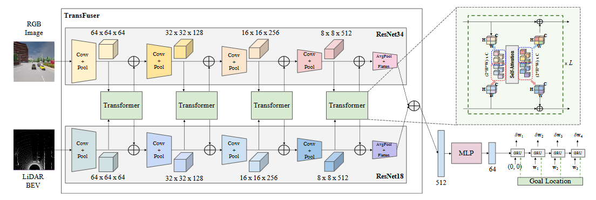
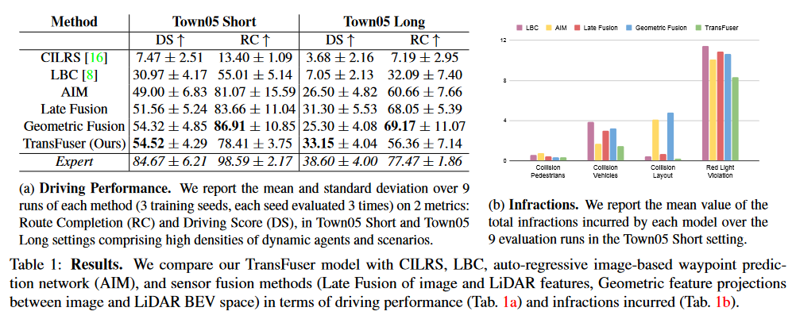
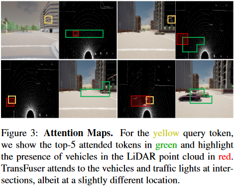
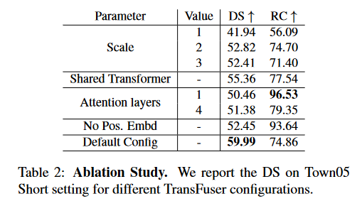

[【Transformer系列论文】TransFuser：端到端自动驾驶的多模态融合Transformer\_Wwwilling的博客-CSDN博客](https://blog.csdn.net/qq_43058281/article/details/119523913)

这篇文章介绍了一种用于自动驾驶系统的多模态融合模型。研究人员观察到传统的融合机制在复杂城市场景中的效果不理想，因为它们无法考虑多个动态实体的行为。为了克服这个问题，他们提出了一种新颖的多模态融合Transformer模型，可以在特征编码的多个阶段集成来自不同模态的信息，并改进了传统的融合方法的局限性。研究人员还探讨了感知任务中的传感器融合方法，并提出了一种基于注意力机制的全局背景建模方法，以实现更好的驾驶性能。

# Abstract

自动驾驶如何整合来自互补传感器的表示？基于几何的传感器融合已经在感知任务，如目标检测和动态预测方面展现出了巨大的潜力。然而，对于实际的驾驶任务来说，3D场景的全局上下文至关重要，例如交通信号灯状态的改变可能会对远离该交通信号灯的车辆的行为产生几何影响。因此，仅凭几何可能不足以有效地融合端到端驾驶模型中的表示。在这项工作中，我们证明了基于现有传感器融合方法的模仿学习策略在高密度的动态智能体和复杂场景中表现不佳，这种情况需要全局上下文推理，例如在无控交叉口处理多个方向的交通。因此，我们提出了TransFuser，一种新颖的多模态融合变形器，使用注意机制来整合图像和LiDAR的表示。我们在CARLA城市驾驶模拟器中通过实验证实了我们方法在涉及复杂场景的城市环境中的有效性。与基于几何的融合相比，我们的方法实现了最先进的驾驶性能，同时将碰撞减少了76%。

# 1.Introduction

最近，仅使用图像的方法[16, 8, 41, 3, 42, 64, 53]和仅使用激光雷达的方法[46, 23]在端到端驾驶方面取得了令人印象深刻的结果。然而，这些研究主要关注动态代理有限的情况，并假设场景中其他代理的行为近乎理想。随着最近CARLA版本中引入对抗性场景（例如，车辆闯红灯，未受控的4路交叉口，或行人从隐蔽区域出现并在随机位置横穿马路），仅使用图像的方法表现不令人满意（表1），因为它们缺乏这些场景所需的场景3D信息。虽然激光雷达包含3D信息，但激光雷达测量通常非常稀疏（特别是在距离较远的情况下），需要额外的传感器来捕捉激光雷达扫描中缺失的信息，例如交通信号灯状态。

\
(<a href="zotero://select/library/items/EWKFBBKH">Prakash 等, 2021, p. 7077</a>)

图1：示意图。考虑一个有左侧对向车流的十字路口。为了安全地驶过十字路口，自动驾驶车辆（绿色）必须捕捉到与交通信号灯（黄色）和车辆（红色）之间的交互有关的全局背景。然而，交通信号灯状态在激光雷达点云中不可见，而车辆在摄像头视图中也不可见。我们的TransFuser模型通过全局注意力机制集成了两种模态以捕捉三维背景并安全导航。

虽然大多数现有的端到端驾驶方法都关注单个输入模态，但自动驾驶系统通常都配备了摄像头和激光雷达传感器[21, 47, 25, 59, 17, 26, 48, 1, 62]。这引发了重要的问题：我们能否整合来自这两种模态的表示，以利用它们的互补优势来进行自动驾驶？我们应该在多大程度上独立处理不同的模态，应该采用什么样的融合机制以获得最大的性能增益？之前在传感器融合领域的工作主要关注驾驶的感知方面，例如2D和3D目标检测[22, 12, 66, 9, 44, 31, 34, 61, 33, 37]，运动预测[22, 36, 5, 35, 63, 6, 19, 38, 32, 9]，和深度估计[24, 60, 61, 33]。这些方法主要关注学习一种状态表示，该状态表示捕捉3D场景的几何和语义信息。它们主要基于图像空间和不同的激光雷达投影空间之间的几何特征投影，例如鸟瞰图（BEV） [22, 12, 66, 9, 44, 31, 34, 61, 33]和范围视图（RV） [39, 37, 22, 38, 9, 51]。信息通常从投影的2D或3D空间中每个特征周围的局部邻域聚合。

尽管这些方法比仅使用图像的方法表现更好，但我们观察到它们的架构设计中存在局部性假设，这妨碍了它们在复杂的城市场景中的表现（表1a）。例如，在处理交叉口交通时，自动驾驶汽车需要考虑多个动态代理和交通信号灯之间的相互作用（图1）。虽然深度卷积网络可以用于捕获单个模态中的全局上下文，但将其扩展到多个模态或模拟特征对之间的相互作用并非易事。为了克服这些限制，我们使用Transformer的注意力机制[54]，将关于3D场景的全局上下文推理直接集成到不同模态的特征提取层中。我们考虑单视图图像和激光雷达输入，因为它们相互补充，我们的重点是整合来自不同类型模态的表示。我们称最终的模型为TransFuser，并将其集成到专为端到端驾驶设计的自动回归式航点预测框架（图2）中。

贡献：

(1) 我们证明基于现有传感器融合方法的模仿学习策略无法处理城市驾驶中的对抗性场景，例如交叉口的非保护转弯或从隐蔽区域出现的行人。

(2) 我们提出了一种新颖的多模态融合Transformer（TransFuser），将3D场景的全局上下文纳入不同模态的特征提取层。

(3) 我们通过在CARLA中涉及对抗性场景的复杂城市环境中进行实验来验证我们的方法，并取得了最先进的性能。我们的代码和训练模型可在https://github.com/autonomousvision/transfuser上获得。

# 2.Related Work

**多模态自动驾驶：**最近的多模态端到端驾驶方法[58, 65, 51, 3]表明，用深度和语义来补充RGB图像有可能提高驾驶性能。Xiao等人[58]从相机和深度模态的早期、中期和晚期融合的角度探索了RGBD输入，并观察到了显著的收益。Behl等人[3]和Zhou等人[65]证明了语义和深度作为驾驶的显式中间表示的有效性。在这项工作中，我们关注图像和激光雷达输入，因为它们在表示场景方面是相互补充的，并且已经在自主驾驶系统中得到广泛应用。在这方面，Sobh等人[51]利用了LiDAR和图像模态的晚期融合架构，其中每个输入被编码成单独的流并然后连接在一起。然而，我们观察到这种融合机制由于无法考虑多个动态代理的行为，因此在复杂的城市场景中会有很高的碰撞率（表1b）。因此，我们提出了一种新颖的多模态融合Transformer，它能够在特征编码过程中的多个阶段有效地集成来自不同模态的信息，从而改进了晚期融合方法的局限性。

**用于对象检测和运动预测的传感器融合方法：**大多数传感器融合工作都考虑了感知任务，例如对象检测[22, 12, 66, 7, 44, 31, 34, 61, 33, 37]和运动预测[36, 5, 35, 63, 6, 19, 38]。它们操作多视图LiDAR，例如鸟瞰图（BEV）和范围视图（RV），或将LiDAR的深度信息补充到相机输入中，通过将LiDAR特征投影到图像空间或将图像特征投影到BEV或RV空间。与我们的方法最接近的是ContFuse[34]，它对图像和LiDAR BEV特征进行多尺度密集特征融合。对于LiDAR BEV表示中的每个像素，它在3D空间中的局部邻域中计算最近邻居，将这些相邻点投影到图像空间以获得相应的图像特征，使用连续卷积聚合这些特征，并将它们与LiDAR BEV特征组合。其他基于投影的融合方法遵循类似的趋势，并聚合2D或3D空间中局部邻域的信息。然而，这些方法学习的状态表示是不足够的，因为它们不能捕捉到3D场景的全局上下文，这在对抗性场景中执行安全机动操作时非常重要。为了证明这一点，我们实现了一种多尺度几何融合机制，受到[34, 33]的启发，涉及图像到LiDAR和LiDAR到图像的特征融合，用于CARLA中的端到端驾驶，并观察到在复杂城市环境中存在高碰撞率（Tab. 1b）。为了克服这一局限性，我们提出了一个基于注意力的多模态融合Transformer，它结合了全局上下文推理并取得了优越的驾驶性能。

**自动驾驶中的注意力机制：**注意力机制已经在车道变更[13]、目标检测[11, 32]和运动预测[32, 50, 49, 28, 15, 30, 29, 56]的驾驶环境中进行了探索。Chen等人[11]采用循环注意力机制来预测车辆控制。Li等人[32]利用注意力机制将Transformer模块融入循环神经网络中，以捕捉不同主体之间的时空依赖关系。SA-NMP[56]是同时进行的工作，它在学习从2D CNN提取的特征上学习注意力掩码，操作在LiDAR BEV投影和HD地图上，专注于动态代理的安全运动规划。Chen等人[13]在分层深度强化学习框架中使用注意力机制，关注周围车辆进行车道变更。他们将空间注意力模块融入其中以检测图像中最相关的区域，并将时间注意力模块融入其中以加权不同时间步长的图像输入，这使得车道变更更加平稳。然而，这些方法都没有考虑到多模态或编码3D场景的全局上下文，这在安全导航对抗性场景中是必要的。相反，我们在具有挑战性的城市驾驶场景中演示了注意力机制对不同模态之间特征融合的有效性。

# 3.Method

在这项工作中，我们提出了一个用于端到端驾驶的架构（图2），它包含两个主要组件：（1）多模态融合Transformer，用于整合来自多个模态（单视角图像和激光雷达）的信息；（2）自回归航点预测网络。以下部分详细介绍了我们的问题设置、输入和输出的参数化，以及模型的每个组件。

图2：架构。我们考虑单视角RGB图像和激光雷达BEV表示（第3.2节）作为我们的多模态融合Transformer（TransFuser）的输入，该Transformer使用多个Transformer模块来融合两种模态之间的中间特征图。这种融合适用于多个分辨率（64×64、32×32、16×16和8×8）的全局特征提取器，导致来自图像和LiDAR BEV流输出一个512维的特征向量，两者通过逐元素求和的方式进行组合。这个512维的特征向量构成了环境的一个紧凑表示，编码了3D场景的全局上下文。然后，该特征向量经过一个MLP处理后传递给一个自回归航点预测网络。我们使用单层GRU，后面接一个线性层，该线性层采用隐藏状态并预测时变的本车航点$\{ \delta w_t \}^T_{t=1}$，这些航点用本车当前坐标系表示。

## 3.1 Problem Setting

我们考虑在城市环境中进行点对点导航的任务[23, 45, 46, 8, 16]，其目标是在安全应对其他动态代理并遵守交通规则的情况下完成给定路线。

**模仿学习（IL）：**IL的目标是学习一个策略$\pi$，模仿专家$\pi ^*$的行为。在我们的设置中，策略是将输入映射到向低级控制器提供输出的航点的映射。我们考虑IL的基于行为克隆（BC）的方法，这是一种有监督的学习方法。首先，专家策略在环境中进行实践以收集一个数据集$D=\{ (\mathcal{X} ^i,\mathcal{W}^i) \}^Z_{i=1}$，大小为Z，包括环境的高维观测$\mathcal{X}$和相应的专家轨迹$\mathcal{W}$，定义为BEV空间中的一组2D航点，即$\mathcal{W}=\{ w_t=(x_t,y_t) \}^T_{t=1}$。这个BEV空间使用本车坐标系。策略π通过使用收集的数据D进行监督训练，损失函数L。
$$
argmin \mathbb{E}_{(\mathcal{X},\mathcal{W}~\mathcal{D})}[\mathcal{L}(\mathcal{W},\pi (\mathcal{X}))] \ \ \ \ (1)
$$

高维观测X包括来自单个时间步的前视摄像头图像输入和激光雷达点云。由于之前在IL上进行自动驾驶的研究表明使用观察历史可能不会导致性能提升[40, 55, 2, 57]，因此我们使用单个时间步的输入。我们使用预测轨迹$\pi(\mathcal{X})$和专家轨迹W之间的L1距离作为损失函数。我们假设可以访问一个逆动力学模型[4]，它实现为一个PID控制器I，执行低级控制，即转向、油门和制动，提供未来的轨迹W。动作确定为$a=\mathbb{I}(\mathcal{W})$。

**全局规划器：**我们遵循CARLA 0.9.10的标准协议，并假设提供高层次目标位置G作为GPS坐标。请注意，这些目标位置是稀疏的，并且可以相距数百米，这与策略π预测的局部航点不同。

## 3.2 Input and Output Parameterization

**输入表示：**按照[45, 23]的方法，我们将激光雷达点云转换为一个2D BEV网格上的2个bin直方图，网格分辨率为固定的。我们考虑前方32米范围内的点，两侧各16米，从而覆盖一个32米×32米的BEV网格。我们将网格划分为0.125米×0.125米的块，得到分辨率为256×256像素。对于直方图，我们将高度维度离散化为两个bin，表示地面上的点和地面以下的点。这产生一个两通道的伪图像，大小为256×256像素。对于RGB输入，我们考虑前视摄像头，其FOV为100度。我们以400×300的分辨率提取前方图像，并将其裁剪为256×256，以去除边缘的径向畸变。

**输出表示：**我们预测自车在以当前自车坐标系为中心的BEV空间中的未来轨迹W。轨迹由一系列2D航点组成，$\{w_t=(x_t,y_t) \}^T_{t=1}$。我们使用T=4，这是我们的逆动力学模型所需的默认航点数。

## 3.3 Multi-Model Fusion Transformer

我们的关键想法是利用Transformer的自我注意力机制[54]，以利用图像和激光雷达（LiDAR）这两种互补模态的全局上下文。Transformer架构接受由离散标记组成的序列作为输入，每个标记由特征向量表示。特征向量由位置编码补充，以包含位置归纳偏差。

形式上，我们将输入序列表示为$F^{in}\in \mathbb{R}^{N\times D_f}$，其中N是序列中的标记数，每个标记由Df维特征向量表示。Transformer使用线性投影来计算一组查询、键和值（Q、K和V），

$$
Q=F^{in}M^q,K=F^{in}M^k,V=F^{in}M^v\ \ \ \  \ (2)
$$

其中，$M^q\in \mathbb{R}^{D_f\times D_q},M^k\in \mathbb{R}^{D_f\times D_k}$和$M^v\in \mathbb{R}^{D_f\times D_v}$是权重矩阵。它使用Q和K之间的缩放点积来计算注意力权重，然后为每个查询聚合值，
$$
A=softmax(\frac{QK^T}{\sqrt{D_k}}V)\ \ \ \ (3)
$$

最后，Transformer使用一个非线性变换来计算输出特征Fout，其与输入特征Fin的形状相同。
$$
F^{out}=MLP(A)+F^{in}  \ \ \ \  \  \ (4)
$$

在整个架构中，Transformer多次应用注意力机制，形成L个注意力层。标准Transformer的每一层都有多个并行的注意力“头”，这涉及到为每个Fin生成多个Q、K和V值，如等式（2）所示，并连接等式（3）中A的结果值。

与 NLP 中的标记输入结构不同，我们对网格结构的特征图进行操作。 与先前将转换器应用于图像的工作类似，我们将每个模态的中间特征图视为一个集合而不是空间网格，并将集合的每个元素视为一个标记。 图像和 LiDAR BEV 输入的卷积特征提取器在不同层对场景的不同方面进行编码。 因此，我们在整个编码器中以多个尺度（图 2）融合这些特征。

让单一模态的中间网格结构化特征图为维度为H×W×C的3D张量。对于S个不同的模态，这些特征堆叠在一起，形成一个维度为(S∗H∗W)×C的序列。我们添加了一个可学习的位置嵌入，这是一个维度为(S∗H∗W)×C的可训练参数，使网络能够在训练时推断不同标记之间的空间依赖关系。我们还通过将标量值投影到C维向量，使用线性层提供当前速度作为输入。输入序列、位置嵌入和速度嵌入使用逐元素相加的方式组合起来，形成一个维度为(S∗H∗W)×C的张量。如图2所示，该张量作为输入传递给transformer，产生相同维度的输出。为了清晰起见，我们在图2中省略了位置嵌入和速度嵌入输入。然后将输出重塑为S个维度为H×W×C的特征图，并与现有的特征图使用逐元素相加的方式反馈到每个独立模态分支。上述机制构成了单一尺度的特征融合。这种融合在图像和LiDAR BEV分支的ResNet特征提取器中多次应用，具有不同的分辨率（图2）。然而，处理高空间分辨率的特征图计算代价昂贵。因此，我们从早期的编码器块中对更高的分辨率特征图进行下采样，使用平均池化到固定的分辨率H=W=8，然后将它们作为输入传递给transformer，并使用双线性插值将输出上采样到原始分辨率，然后与现有的特征图进行逐元素相加。

在执行多个分辨率的密集特征融合后（图2），我们从每个模态的特征提取器中获得一个维度为8×8×512的特征图，对于输入分辨率为256×256像素。这些特征图通过平均池化被降低到1×1×512的维度，并展平为512维特征向量。来自图像和LiDAR BEV流的512维特征向量通过逐元素相加的方式组合在一起。这个512维的特征向量构成了对环境的紧凑表示，编码了3D场景的全局上下文。然后将其输入到航点预测网络中，我们接下来将对其进行描述。

## 3.4 Waypoint Prediction Network

如图2所示，我们将512维的特征向量通过一个MLP（包含2个隐藏层，每个隐藏层有256和128个单元）以降低其维度至64，以实现计算效率，然后将它传递给使用GRUs实现的自动回归航点网络[14]。我们使用64维的特征向量初始化GRU的隐藏状态。GRU的更新门控制隐藏状态中编码的信息流向输出和下一个时间步。它还接收当前位置和目标位置（第3.1节）作为输入，这使得网络能够关注隐藏状态中与预测下一个航点相关的上下文。我们将目标位置的GPS坐标（注册到自车坐标系）作为输入提供给GRU而不是编码器，因为它们处于与预测航点相同的BEV空间中，与它们的相关性优于在透视图图像域中表示目标位置[8]。按照[23]的做法，我们使用单层GRU后跟一个线性层，该线性层采用隐藏状态并预测在当前自车坐标系中未来T=4个时间步的自车航点$\{ \delta w_t\}^T_{t=1}$。因此，预测的未来航点由$\{w_t=w_{t-1}+\delta w_t \}^T_{t=1}$给出。第一个GRU单元的输入为(0,0)，因为BEV空间以自车的位置为中心。

**控制器：**我们使用两个PID控制器进行横向和纵向控制，以从预测航点$\{w_t\}^T_{t=1}$中获得转向、油门和制动值。纵向控制器采用连续时间步航点之间向量的加权平均值的大小作为输入，而横向控制器采用它们的方向作为输入。对于PID控制器，我们采用与[8]中提供的代码库相同的配置。具体实现细节可以在补充材料中找到。

## 3.5 Loss Function

按照[8]所述，我们使用预测航点与注册到当前坐标系的真实航点（来自专家）之间的L1损失来训练网络。设$w^{gt}_{t}$代表时间步t的真实航点，则损失函数由下式给出：

$$
\mathcal{L}=\sum^T_{t=1}\Vert w_t-w^{gt}_t\Vert_1 \ \ \ \ \ (5)
$$

请注意，仅在训练时才可用的真实航点$\{w^{gt}_{t}\}$与在训练和测试时都提供的稀疏目标位置$\mathcal{G}$是不同的。

# 4. Experiments

在本节中，我们描述了我们的实验设置，并将我们的方法的驾驶性能与几个基线进行了比较，进行了违规分析以研究不同的故障情况，可视化了TransFuser的注意力图，并进行了消融研究以突出我们模型不同组件的重要性。

任务：我们考虑在各种区域（如高速公路、城市区域和居民区）沿一组预定义路线进行导航的任务。路线由全局规划器提供的GPS坐标中的一系列稀疏目标位置和相应的离散导航命令定义，例如跟随车道、左转/右转、变换车道。我们的方法仅使用稀疏的GPS位置进行驾驶。每条路线包含多个场景，在预定义的位置初始化，测试智能体处理各种对抗情况的能力，例如避障、交叉口的无保护转弯、闯红灯的车辆，以及从遮挡区域出现的行人随机穿越道路。智能体需要在规定的时间限制内完成路线，同时遵守交通规则并应对高密度动态智能体的挑战。

数据集：我们使用CARLA [21]模拟器进行训练和测试，特别是CARLA 0.9.10，它包含8个公开城镇。我们使用7个城镇进行训练，并保留Town05进行评估。为了生成训练数据，我们推出了一种使用模拟中的特权信息设计的专家策略，并以2FPS的速度存储数据。请参阅补充材料以获取更多详细信息。我们选择Town05进行评估，因为与其他CARLA城镇相比，其可驾驶区域具有很大的多样性，例如多车道和单车道道路、高速公路和出口、桥梁和地下通道。我们考虑两种评估设置：(1) Town05 Short：由10条短途路线组成，每条路线长度为100-500m，包括3个交叉口；(2) Town05 Long：由10条长途路线组成，每条路线长度为1000-2000m，包括10个交叉口。每条路线都由高密度的动态代理和在预定义位置生成的对抗性场景组成。由于我们关注的是处理动态代理和对抗性场景，因此我们将这一方面与对不同天气条件的泛化能力分开来评估，仅在ClearNoon天气下进行评估。

度量：我们报告了3项指标的结果。(1)路线完成率（Route Completion，RC），完成路线距离的百分比；(2)驾驶评分（Driving Score，DS），该评分由路线完成率加权得到，其中权重由一个违规乘数决定，违规乘数考虑了与行人、车辆和静态元素的碰撞、路线偏离、车道违规、闯红灯和违反停车标志的次数；(3)违规次数（Infraction Count）。有关度量和违规的更多详细信息请参阅补充材料。

基线：我们将TransFuser模型与几种基线进行比较。(1) CILRS [16]是一种条件模仿学习方法，其中智能体从单个前视摄像头图像中学习预测车辆控制，同时受导航命令的支配。我们严格遵循作者提供的代码，对CARLA 0.9.10的CILRS进行重新实现，以考虑与CARLA 0.8.4相比的额外导航命令。(2) LBC [8]是一种知识蒸馏方法，其中教师模型可以访问地面真实BEV语义图，首先使用专家监督进行训练以预测未来航点，然后使用来自教师的监督进行图像式学生模型的训练。它是目前CARLA 0.9.6上的最佳方法。我们使用最新的作者提供的代码库在CARLA 0.9.10上进行训练，该代码库通过将不同的视点作为通道堆叠来组合3个输入摄像头视图。(3) 自动回归基于图像的航点预测（AIM）：我们实现了我们的自动回归航点预测网络，其中包含一个基于图像的ResNet-34编码器，仅将前视摄像头图像作为输入。这个基线相当于将CILRS模型适应为预测航点，航点条件是稀疏目标位置而不是车辆控制，车辆控制条件是导航命令。用于此的图像编码器与CILRS和我们的模型相同。(4) 晚期融合：我们实现了我们的架构的一个版本，其中图像和LiDAR特征彼此独立提取（与TransFuser不同，没有Transformer，类似于[51]），然后通过元素逐点相加进行融合，并传递给航点预测网络。(5) 几何融合：我们实现了一种多尺度几何融合方法，灵感来自[34, 33]，涉及图像到LiDAR和LiDAR到图像的特征融合。我们将LiDAR BEV表示中的每个0.125m × 0.125m块投影到3D空间中，形成3D体素。我们随机从该3D体素中的LiDAR点云中选取5个点，并将它们投影到图像空间。我们通过逐元素求和聚合这些点的图像特征，然后将它们传递给一个3层的多层感知机（MLP）。然后，将MLP的输出与相应0.125m × 0.125m块的多分辨率LiDAR BEV特征相结合。同样，对于每个图像像素，我们聚合来自多分辨率LiDAR BEV特征的信息。这个基线相当于用基于投影的特征融合替换我们架构中的转换器。

***

CILRS是一种条件模仿学习方法，它通过分析人类驾驶者在真实道路环境中的驾驶数据，学习并模仿人类的驾驶行为，从而实现自动驾驶任务。

具体来说，CILRS首先需要收集人类驾驶者在真实道路环境中的驾驶数据，包括车辆的传感器信息（如摄像头图像、激光雷达数据等）以及驾驶者的操作行为（如方向盘角度、油门踏板位置等）。然后，CILRS通过将这些图像数据和操作行为数据进行对应，建立条件映射关系，即根据图像数据预测对应的操作行为。

在训练过程中，CILRS使用机器学习算法对收集的数据进行学习和模拟，以建立对人类驾驶行为的模仿能力。一旦模型训练完成，它可以接收车辆传感器数据作为输入，并根据学习到的驾驶规律做出相应的操作决策，如转向、制动、加速等，从而实现自动驾驶。

CILRS方法在自动驾驶领域具有广泛的应用前景，例如自动泊车、自动跟随、避障导航等场景。然而，它也面临着一些挑战，如数据获取与标注的难度、模型泛化能力的提升、道德与法律问题等。需要进一步的研究和实践来解决这些问题。

**LBC是一种基于标签的知识蒸馏方法**。这种方法的核心思想是使用一个已经训练好的大模型（教师模型）去指导一个小模型（学生模型）的训练。在这个过程中，大模型的标签信息被用作额外的监督信号，以帮助提升小模型的性能。

具体来说，LBC首先使用大模型对输入数据进行预测，生成一组标签。然后，这些小模型的训练过程中，除了使用原始标签进行监督外，还引入了大模型生成的标签作为额外的监督信息。通过这种方式，小模型可以从大模型中学习到更丰富的知识和模式，从而提高其泛化能力和性能。

需要注意的是，LBC方法中的大模型通常需要具备较高的精度和泛化能力，以确保其生成的标签信息是准确和可靠的。同时，小模型的设计也需要考虑到其与大模型之间的知识传递效率和学习效果。

总之，LBC是一种有效的知识蒸馏方法，能够通过迁移大模型的知识来提升小模型的性能，对于模型压缩和加速等任务具有重要的意义。

***

我们还报告了用于生成训练数据专家的结果，该结果定义了每个评估设置的性能上限。关于所有基线的更多详细信息，请参阅补充材料。

实现细节：我们使用2个传感器模态，即前视摄像头RGB图像和转换为BEV表示的LiDAR点云（第3.2节），即S=2。RGB图像使用预训练在ImageNet上的ResNet-34 [27]进行编码。LiDAR BEV表示使用从头开始训练的ResNet-18 [27]进行编码。在默认的TransFuser配置中，我们为每个分辨率使用1个变压器，并为每个变压器使用4个注意力头。我们从{64,128,256,512}中选择Dq、Dk、Dv，对应于每个分辨率的特征嵌入维度Df的4个Transformer。对于我们的每个基线，我们测试了不同的感知主干网络，并选择了最佳配置：CILRS和AIM使用ResNet-34，LBC使用ResNet-50，每个传感器融合方法使用ResNet-34作为图像编码器和ResNet-18作为LiDAR BEV编码器。更多详细信息请参阅补充材料。

## 4.1 Results

**CILRS和LBC的性能：**在我们的第一个实验中，我们检查了当前的基于图像的方法在CARLA 0.9.10评估设置中的扩展程度，该评估设置涉及复杂的多个车道交叉口、对抗性场景和严重的违规处罚。从表1a中的结果我们可以观察到，CILRS在所有评估设置上的表现都很差。这并不奇怪，因为CILRS依赖于具有不平衡数据分布的离散导航命令（参见补充说明）。虽然原始的LBC [8]架构仅使用前视摄像头图像作为输入，但该文的作者最近发布了一个更新版本的架构，其中进行了2个主要的修改：(1)多视图相机输入（前、45度左和45度右）；(2)目标heatmap作为输入（而不是导航命令），通过将稀疏目标位置投影到图像空间形成。我们在我们的数据上训练他们的更新模型，并观察到LBC在短途路线上的表现明显优于CILRS（表1a），这是预期的，因为它是使用来自教师模型的监督进行训练的，该模型使用地面真实BEV语义标签。然而，当在长途路线上进行评估时，LBC的性能急剧下降，虽然实现了32.09 RC，但因频繁闯红灯和与车辆碰撞导致多重违规，导致DS值较低，为7.05（表1b）。这些结果表明，CILRS和LBC无法处理城市驾驶的复杂性。

**AIM是一个强大的基线：**由于CILRS和LBC的性能在长途路线上显著下降，我们接下来专注于设计一个强大的基于图像的基线。为了实现这一目标，我们将CILRS中学到的控制器替换为我们的自回归航点预测网络。我们观察到，AIM在所有评估设置中显著优于CILRS（表1a），性能提高了近7倍。这很可能是因为AIM使用我们的逆动力学模型（PID控制器）进行低级控制，并在航点预测的相同BEV坐标空间中表示目标位置。相比之下，LBC的目标位置表示为图像空间中的热图。此外，AIM使用基于GRU的自回归航点预测网络，这使得可以直接在网络最终阶段处理这些目标位置。这提供了先验，简化了对遵循路径到目标位置的行为的学习，这可能使编码器优先考虑场景的高层次语义信息（例如交通灯状态），而不是与低级控制相关的特征。在短途路线方面，AIM比LBC高出58.21%；在长途路线方面，高出275.89%。LBC的闯红灯违规导致其他违规（例如与车辆碰撞）的加剧，这使得其DS迅速下降，而AIM则没有这个问题。

**传感器融合方法**:本实验的目标是确定LiDAR模态对驾驶性能的影响，并比较不同的融合方法。为此，我们将TransFuser与两个基线进行比较，即晚期融合（LF）和几何融合（GF）。我们观察到，LF在所有评估设置中都优于AIM（表1a）。这是预期内的结果，因为LiDAR提供了额外的3D环境信息，有助于智能体更好地在城市环境中导航。此外，我们观察到，在短途路线中，当将图像和LiDAR分支的独立特征提取器替换为多尺度基于几何的融合编码器时，性能甚至更好。然而，与RC相比，LF和GF的DS都急剧下降。我们假设这是因为它们没有融入全局上下文推理，这对于安全通过交叉路口是必要的，并且它们主要关注不惜一切代价导航到目标，而忽略了障碍物，这导致了多次违规（表1b）。由于违规处罚的指数性质，这对长途路线产生了复合效应，导致DS迅速下降。相比之下，我们的TransFuser模型在DS上比GF高出31.02%，在Town05长途路线上的RC降低了18.52%。与LF相比，它减少了51.58%的碰撞，与GF相比减少了76.11%的碰撞；与LF相比减少了23.5%的红灯违规，与GF相比减少了21.93%的红灯违规。这表明我们的模型驾驶谨慎，并专注于动态智能体和交通灯。这表明注意力可以有效地融入3D场景的全局上下文，从而实现安全驾驶。我们在补充材料中提供了驾驶视频。

**局限性**：我们观察到所有融合方法在红灯违规上都存在问题（表1b）。这是因为在Town05中检测红灯是非常具有挑战性的，因为它们位于交叉口的对面，在输入图像中几乎看不到。与某些现有方法[53]不同，我们没有使用任何针对红灯的语义监督，这进一步加剧了这一问题，因为红灯检测的学习信号非常微弱。当我们纳入这种额外的监督时，预计融合方法的红灯检测性能会有所提高。这些局限性提供了未来研究的方向，例如探索如何增强红灯的可见性，或者如何更有效地利用语义监督来提升红灯检测的性能。

## 4.2 Attention Map Visualizations

我们使用Transformer模型，它接受64个图像特征标记和64个LiDAR特征标记作为输入，每个标记对应输入模态中的一个32x32补丁。我们考虑了来自Town05交叉口的1000帧，并检查了图像特征映射中第2、3、4行的24个标记和LiDAR特征映射中第4、5、6行的24个标记的顶部-5注意力权重。我们选择这些标记，因为它们对应于输入模态中的交叉口区域，并包含交通信号灯和车辆。我们观察到，对于62.75%的图像标记，顶部-5关注的所有标记都属于LiDAR，至少有88.87%的标记，顶部-5关注的一个标记属于LiDAR。同样，对于78.45%的LiDAR标记，顶部-5关注的所有标记都属于图像，至少有98.95%的标记，顶部-5关注的一个标记属于图像。这表明TransFuser有效地聚合了来自图像和LiDAR的信息。我们在图3中显示了四个这样的帧。我们注意到注意力地图有一个共同的趋势：TransFuser关注交叉口处的车辆和交通信号灯，尽管在图像和LiDAR特征映射中的位置略有不同。补充材料中提供了更多的可视化信息。

## 4.3 Ablation Study

在我们的默认配置中，我们每个分辨率使用1个Transformer，每个Transformer有8个注意力层和4个注意力头，并在4个分辨率上进行融合。在本实验中，我们在Town05 Short评估设置中对尺度数量、注意力层数、共享或独立的Transformer和位置嵌入进行消融实验。

**多个尺度融合是必要的吗？**我们在1到4的尺度上展示了结果，其中1表示在最后一个ResNet层中以8x8的分辨率进行融合，2表示分别在最后一个和倒数第二个ResNet层中以8x8和16x16的分辨率进行融合，类似地，对于尺度3和4。 我们观察到，当将尺度数量从4减少到1时，性能整体下降（Tab. 2）。 这是因为ResNet中的不同卷积层学习有关输入的不同类型的特征，因此，多尺度融合可以有效整合来自不同模态的特征。

**使用多个Transformer是必要的吗？**我们对使用共享参数的Transformer版本（Tab. 2中的Shared Transformer）进行了测试，并观察到DS显著下降。 这是有原因的，因为ResNet中的不同卷积层学习不同类型的特征，因此每个Transformer必须在每个分辨率上关注融合不同类型的特征。

**是否需要多个注意力层呢？**我们在表2中报告了我们TransFuser的1层和4层变体的结果。我们观察到，虽然1层变体的RC非常高，但其DS显著降低。然而，当我们将注意力层的数量增加到4时，即使RC降低18%，模型也能保持其DS。这表明模型在增加注意力层后变得更谨慎。当我们在默认配置中将L进一步增加到8时，DS也增加。这表明多个注意力层会导致驾驶代理更谨慎。

**位置嵌入有用吗？**直观上，我们预计可学习的位置嵌入会有所帮助，因为对动态主体之间的空间依赖关系进行建模对于安全驾驶至关重要。这在表2中是显而易见的，因为我们观察到，如果没有位置嵌入，即使RC增加了25%，DS也会显著下降。

# 5. Conclusion

在这项工作中，我们证明了基于现有传感器融合方法的模仿学习策略在复杂的驾驶场景中受到高违规率的限制。为了克服这一限制，我们提出了一种新颖的多模态融合Transformer（TransFuser），用于整合不同模态的表征。TransFuser利用注意力机制捕获全局3D场景上下文，并关注动态代理和交通灯，从而在CARLA上实现最先进的性能。鉴于我们的方法是灵活和通用的，进一步探索添加额外传感器（例如雷达）或将其应用于其他具身人工智能任务将是很有趣的。
